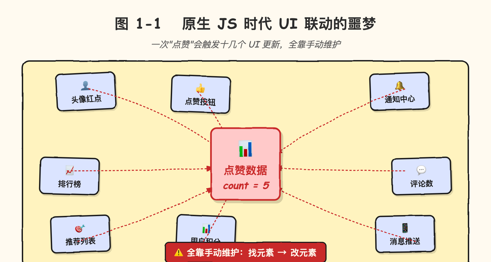
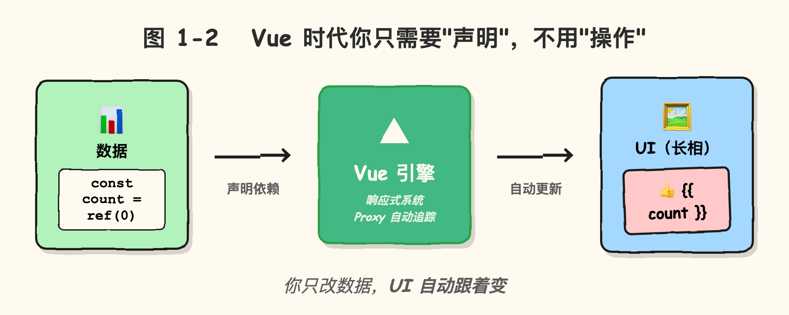

# 1.1 Vue 是个啥玩意儿

> 章节：第 1 章 Vue 入门与准备
> 课时：1 课时

---

## 🎯 学习目标

学完这节，你将能够：

- ✅ **理解**：Vue 是什么、它解决什么问题
- ✅ **理解**：组件化思维的雏形（不需要马上写，先有概念）
- ✅ **了解**：Vue 的发展历史和当前版本
- ✅ **了解**：Vue 在前端生态中的位置

---

## 🧠 思维导图


```text
1.1 Vue 是个啥玩意儿
├── Vue 的定义
│   ├── JavaScript 框架（库 vs 框架的区别）
│   ├── 用于构建用户界面（UI）
│   └── 由尤雨溪 2014 年开源
├── Vue 解决什么问题
│   ├── 原生 JS 时代的痛点
│   ├── 单页应用（SPA）的兴起
│   └── 组件化开发的必然
├── Vue 的核心特点
│   ├── 渐进式框架（可逐步采用）
│   ├── 组件化
│   ├── 响应式数据绑定
│   └── 强大的中文社区
└── Vue 当前版本（2024-2026）
    ├── Vue 2（老项目维护）
    ├── Vue 3（当前主流）
    └── 本书使用 Vue 3 主讲
```

---

> 🧑 **小白**：听说 Vue 是前端三大框架之一？听着好高级。

> 🤖 **Vue 君**：别慌，我不是高冷的框架，我是你身边的"自动装修工"。

> 👨🏫 **老湿**：一句话——你只要说"我要什么效果"，Vue 帮你把页面自动变出来。这节咱们就把这事聊明白。

---

刚接触前端时你可能听过这样的对话：朋友问"你们做的网页是用什么写的？"，你答"Vue"，对方一脸懵："Vue？那是什么，能吃吗？"别笑，这其实是每个 Vue 学习者都要跨过的第一道坎——**你天天在用 Vue，却说不清它到底解决了什么问题**。这节不写代码，先把这个"是什么"讲透，后面动手时才不会心里没底。

---

## 🤔 一、为什么需要 Vue？

我们先回到一个朴素的问题：**网页上的 UI 到底是什么？**

不管你打开淘宝、抖音、学校的官网，你看到的每一个按钮、每一行文字、每一张图片，本质上都是**"一段数据 + 一个长相"**的组合：

| 元素 | 数据 | 长相 |
|---|---|---|
| "立即购买"按钮 | 文字"立即购买" | 红色圆角矩形 |
| 用户头像 | 用户名 + 头像 URL | 圆形图片 + 边框 |
| 文章列表 | 文章数组（标题、作者、时间） | 卡片网格布局 |

那问题就来了：**当数据变化时，怎么让"长相"跟着变？**

> 👨🏫 **老湿**：这听起来像废话——"数据变了，长相就跟着变呗"。但实际操作起来，用原生 JS 维护"数据→UI"非常痛苦。下面我们看个例子。

### 原生 JS 时代怎么做？

假设页面上有一个"点赞"按钮，点击后数字要 +1：

```javascript
// 原生 JS 写法
// 第 1 步：找到"点赞按钮"这个 DOM 元素（id 选择器）
const likeBtn = document.querySelector('#like-btn');

// 第 2 步：在按钮内部找到"显示数字的那个 span"
const countEl = likeBtn.querySelector('.like-count');

// 第 3 步：给按钮绑定"点击"事件监听器
// 第一个参数是事件名 'click'，第二个是事件处理函数
likeBtn.addEventListener('click', () => {
  // 第 4 步：从 DOM 读出当前显示的数字
  // 为什么要 parseInt？因为 textContent 返回的是字符串 "5"，
  // 而我们要做 +1 加法，必须先转成数字 5
  const current = parseInt(countEl.textContent);

  // 第 5 步：把新数字写回 DOM（自动转成字符串显示）
  countEl.textContent = current + 1;

  // 第 6 步：根据数字大小，判断要不要加"热门"样式
  // classList.add() 是给元素加 CSS class
  if (current + 1 > 100) {
    likeBtn.classList.add('hot');
  }
});
```

短短 5 行代码，要操心的事情就有一大堆：

- **找元素**（`querySelector` / `getElementById`）—— 你得知道元素在 DOM 树里藏哪儿
- **读旧值、算新值**——数据存哪里？是 DOM 里还是 JS 变量里？
- **直接改 DOM**——改完怎么触发浏览器重新画？
- **联动其他 UI**（热度标记）——UI 之间怎么保持一致？

**这只是最简单的场景。** 想象一下——点赞后，要不要改用户头像上的小红点？要不要改通知中心？要不要改排行榜？这些 UI 之间的联动，**用原生 JS 全程手写**，代码会迅速变成一团乱麻。



> 👨🏫 **老湿**：上面这张图就是真实项目里 UI 联动的噩梦——一个数据变化要触发十几个 UI 更新。手动维护"找元素→改元素"的逻辑，bug 多到怀疑人生。

> 🧑 **小白**：那 Vue 是怎么破局的？

> 👨🏫 **老湿**：别急，下面就是见证奇迹的时刻。

### Vue 时代怎么做？

```vue
<!-- Vue 3 单文件组件写法（SFC, Single-File Component） -->
<!--
  这是一个 .vue 文件，包含三块：
  - <template>：HTML 结构（长相）
  - <script setup>：JS 逻辑（数据 + 行为）
  - <style>：CSS 样式（可选）
-->
<script setup>
// 第 1 步：从 'vue' 引入 ref 函数
// ref 是 Vue 提供的"响应式数据容器"
// 用 ref() 包过的数据，变化时 UI 会自动跟着变
import { ref } from 'vue'

// 第 2 步：声明一个叫 count 的"响应式数据"，初始值 0
// ref(0) 返回的是一个对象 { value: 0 }
// 在 <script> 里要写 count.value，在 <template> 里直接写 count
const count = ref(0)

// 第 3 步：写一个"点击 +1"的事件处理函数
// 注意：这里不用管"找元素"、"改 DOM"这些事
function increment() {
  count.value++  // 直接改数据，UI 会自动跟着变
}
</script>

<template>
  <!--
    第 4 步：写"长相"
    @click 是 Vue 的"事件绑定"语法（等价于 addEventListener('click', ...)）
    {{ count }} 是"插值表达式"，会把 count.value 的值渲染到这
    :class 是"属性绑定"（等价于 element.setAttribute('class', ...)）
  -->
  <button @click="increment" :class="{ hot: count > 100 }">
    👍 {{ count }}
  </button>
</template>
```

**你只需要做三件事**：
1. 引入 `ref`（数据容器）
2. 声明"数据是什么"（`count = ref(0)`）
3. 声明"数据 → 长相"的映射（`<template>` 里的 `{{ count }}` 和 `:class`）

**剩下的，Vue 帮你搞定**：当 `count.value` 变化时，Vue 自动重新渲染对应的 UI 节点，自动联动"热度"className，甚至自动批处理多个状态变化。



> 🤖 **Vue 君**：我是 `ref` 的保管员——你只管把数据交给我，页面上的显示我全包了。

> 📌 **记忆点**：命令式 = 你亲手改 DOM；声明式 = 你描述结果，Vue 代劳。这是全书最重要的思维转变之一。

---

## 💡 二、Vue 到底是什么？

经过上面的对比，我们来给 Vue 下个**准确**的定义：

> **Vue 是一个用于构建用户界面的 JavaScript 渐进式框架。**

注意两个关键词：

### 1. "框架"（Framework），不是单纯的"库"（library）

| | 库（Library） | 框架（Framework） |
|---|---|---|
| **控制权** | 你调用库 | 框架调用你 |
| **比喻** | 你借工具自己干活 | 老板指挥你干活 |
| **代表** | React、Lodash | **Vue**、Angular、Django |

> 👨🏫 **老湿**：Vue 自称"渐进式框架"——轻量时像库、全面时像框架。只想做个小交互？引一个 Vue 就行；要做大型应用？路由、状态管理、构建工具全套伺候。

> 🧑 **小白**：懂了，就像吃火锅——一个人可以吃小份，一群人也能开大桌。

> 👨🏫 **老湿**：这个比喻我给你满分。

### 2. "用户界面"（UI），不是"应用"

Vue 不处理后端、不处理数据库、不处理网络——它只关心**屏幕上显示什么**。这听起来很局限，但实际上 90% 的应用体验都来自 UI，把这一件事做好就值 100 分。

---

## 🔍 三、Vue 的四大特点

### 特点 1：渐进式（Progressive）

这是 Vue 最大的特点。**你可以按需引入 Vue 的能力**：

```text
阶段 1：单页面小交互（Vue 核心 + 模板语法）
    ↓
阶段 2：单页应用 SPA（+ Vue Router 路由）
    ↓
阶段 3：复杂状态管理（+ Pinia 状态库）
    ↓
阶段 4：完整工程化（+ Vite 构建 + TS + 测试）
```

不像 Angular 那样"全家桶必须一起上"，Vue 让你**按项目规模逐步采用**。

### 特点 2：组件化（Component-Based）

把 UI 拆成一个个独立的小积木（组件），每个组件只管自己的一块：

```
<!-- 一个完整的"商品卡片页"可以拆成 4 个组件 -->
<template>
  <Page>
    <!-- Header 组件：处理顶部导航 -->
    <Header />

    <!-- ProductCard 组件：处理商品卡片显示 -->
    <!--
      :name 是 Props 传递（父传子）
      @buy 是事件订阅（子传父）
    -->
    <ProductCard
      :name="product.name"
      :price="product.price"
      @buy="handleBuy"
    />

    <!-- Footer 组件：处理底部信息 -->
    <Footer />
  </Page>
</template>
```

每个组件可以独立开发、测试、复用。这部分我们在**第 3 章"组件化思想"**详细讲。

### 特点 3：响应式数据绑定（Reactivity）

这是 Vue 的"魔法"——**当数据变化时，UI 自动跟着变**。

```vue
<script setup>
import { ref } from 'vue'
const message = ref('Hello Vue!')
// 改 message.value，页面上所有用到 message 的地方会自动更新
</script>

<template>
  <!-- 这里会自动显示最新值 -->
  <h1>{{ message }}</h1>
  <input v-model="message" />
</template>
```

> 🤖 **Vue 君**：我有个"自动跟班"叫 Proxy，你改数据它立刻帮你改页面，比老板催进度还快。

> 💡 **小贴士**：现在你只需要记住"改数据 → 页面自动变"这个结论，底层原理第 5 章再拆。

### 特点 4：强大的中文社区

这是 Vue 相比 React 最大的差异化优势：

- ✅ 官方文档有**完整中文翻译**（react.dev 也有中文，但 Vue 文档更地道）
- ✅ 中文教程**海量**（B 站、慕课网、掘金、思否）
- ✅ 中文 issue 响应快
- ✅ 尤雨溪本人是中国人，社区氛围友好

你永远不会"孤军奋战"。

---

## 📅 四、Vue 的版本历史

| 版本 | 发布时间 | 重大变化 |
|---|---|---|
| Vue 0.x | 2014 | 尤雨溪个人项目 |
| Vue 1.x | 2015 | 正式开源，发布到全球 |
| Vue 2.x | 2016 | 组件化、单文件组件（SFC） |
| **Vue 2.7** | 2022 | 2.x 末期：移植部分 Vue 3 特性 |
| **Vue 3** | 2020 | **组合式 API（Composition API）、Proxy 响应式、Teleport、Suspense** |
| **Vue 3.4+** | 2023-2024 | **更快的响应式、defineModel 稳定** |

> 👨🏫 **老湿**：本书以 **Vue 3** 为主讲，使用**`<script setup>`**语法（Vue 3 的推荐写法）。**不教 Vue 2**——除非你们公司有 Vue 2 老项目维护需求。

---

## 🆚 五、Vue vs React（横向对比）

| 维度 | Vue 3 | React 18 |
|---|---|---|
| **类型** | 渐进式框架 | 库 |
| **API 风格** | 模板 + 选项式 + 组合式 | JSX + 函数组件 |
| **学习曲线** | 平缓 | 中等 |
| **中文社区** | 🔥🔥🔥 | 🔥🔥 |
| **响应式原理** | Proxy 自动追踪 | 手动 `setState` / `useState` |
| **企业偏好** | 中小公司、政务、外包 | 中大型公司 |
| **移动端** | uni-app | React Native |

> 👨🏫 **老湿**：选 Vue 不是因为它"最好"，而是因为它**最适合大专教学**——模板语法更接近 HTML、响应式更"自动"、中文社区更友好。**学完 Vue 再学 React 也很快**，1-2 周就能上手。

---

## ⚠️ 六、新手常见误区

> 💡 **小贴士**：下面 5 个误区是面试高频题，也是新手最爱踩的坑，建议截图收藏。

### 误区 1：Vue 只能写小项目 ❌

**真相**：Vue 3 完全能撑起大型项目。Vue 官方文档、GitLab、Bilibili 后台、京东部分业务都是 Vue 写的。**Vue 不是"小清新"框架，是真能干活的工业级工具**。

### 误区 2：模板语法比 JSX 弱 ❌

**真相**：模板语法更适合**视觉型开发者**（设计师转前端），JSX 更适合**逻辑型开发者**（后端转前端）。两者最终都能编译成相同的渲染函数，**只是写法不同**。

### 误区 3：必须用选项式 API（Vue 2 风格）❌

**真相**：Vue 3 主推**组合式 API**（`<script setup>`），更灵活、更易复用、TypeScript 支持更好。**新项目不要再用选项式了**。

### 误区 4：响应式很慢 ❌

**真相**：Vue 3 用 `Proxy` 实现响应式，比 Vue 2 的 `Object.defineProperty` 性能好 1-2 倍。配合 `shallowRef`、`shallowReactive` 等 API，可以做精细化性能优化。

### 误区 5：Vue 跟 React 语法很像，不用学 ❌

**真相**：两者思路相似（都是组件化、声明式），但**具体 API 完全不同**——`ref` vs `useState`、`reactive` vs `useReducer`、`v-model` vs 受控组件、`emit` vs 回调 Props。**需要认真学**。

别看两者都是"组件化 + 声明式"，真正写起来 API 差别很大，不信看这张对照表：

| 对比维度 | Vue 3 | React 18 |
|---|---|---|
| 状态声明 | `ref()` / `reactive()` | `useState()` |
| 复杂状态 | `reactive` | `useReducer` |
| 双向绑定 | `v-model` | 受控组件（`value` + `onChange`） |
| 子传父 | `emit` | 回调 Props |
| 模板写法 | HTML 模板（`<template>`） | JSX（`return (...)`） |
| 更新机制 | Proxy 自动追踪 | 手动 `setState` 触发 |

---

## 🧠 本节小结

- **Vue 是什么**：用于构建 UI 的 JavaScript **渐进式框架**，不是单纯的库
- **核心思想**：声明式 + 响应式——你说"想要啥"，Vue 帮你"自动变成啥"
- **解决痛点**：原生 JS 时代改 UI 太累，数据变了页面要能自动跟着变
- **核心特点**：渐进式、组件化、响应式、中文社区强（一句话记忆：Vue = 你说"想要啥" → Vue 自动"变成啥"）
- **本书写法**：Vue 3 + 组合式 API（Composition API）+ `<script setup>`

> 下一步：1.2 我们来把运行 Vue 需要的环境一件件装好。

---

## 📝 即时练习

**练习 1（概念理解）**：
用你自己的话，向一个完全不懂编程的朋友解释：Vue 跟原生 JS 的最大区别是什么？（100 字以内）

**练习 2（场景判断）**：
以下场景是否适合用 Vue？为什么？
- 一个简单的个人博客（3-5 个页面）
- 一个实时聊天应用（高频 UI 更新）
- 一个后台管理系统（表格、表单、图表）

**练习 3（选做 / 思考题）**：
打开 [Vue 3 官方文档](https://cn.vuejs.org)，看看首页的代码示例，记录下你"看不懂的语法"，我们后续章节会一个个拆解。

---

## 📚 拓展阅读

- [Vue 3 官方文档 - 快速上手](https://cn.vuejs.org/guide/quick-start.html)（必读，但可以先收藏）
- [Vue 3 哲学 - 渐进式框架](https://cn.vuejs.org/guide/introduction.html)（官方对"为什么用 Vue"的回答）
- [Vue 3 单文件组件](https://cn.vuejs.org/guide/scaling-up/sfc.html)（第 1.3 节会用到）

> 🐱 **课间彩蛋**：Vue 的 logo 为什么是 V 形？除了代表 "Vue"，它其实是个"渐变 V"——暗喻框架的"渐进式"理念，从一个小 V 慢慢变大，跟你的项目一起成长。是不是有点浪漫？

---

**（1.1 节结束，下一节 1.2 我们开始装环境 →）**