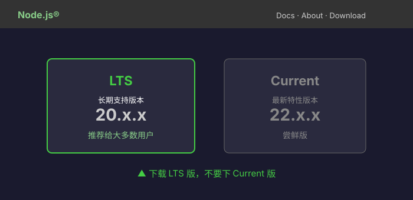
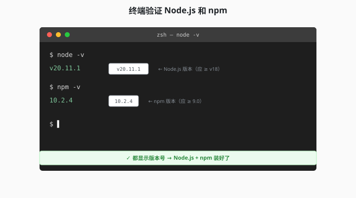
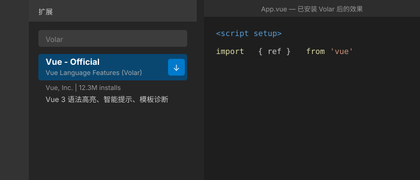

# 1.2 环境搭建：装好工具箱

> 章节：第 1 章 Vue 入门与准备
> 课时：1 课时

---

## 🎯 学习目标

学完这节，你将能够：

- ✅ 在自己电脑上**装好 Node.js**（运行 Vue 的基础）
- ✅ 安装 **VS Code** + Vue 官方插件
- ✅ 安装 **Vue DevTools**（浏览器调试神器）
- ✅ 验证环境是否装好（在终端跑 `node -v` 等命令）
- ✅ **理解**：每个工具是干什么的，为什么需要它

---

## 🧠 思维导图


```text
1.2 环境搭建：装好工具箱
├── 三大基础工具
│   ├── Node.js（运行 JavaScript）
│   ├── npm（包管理）
│   └── 浏览器（运行 Vue 应用）
├── 推荐开发工具
│   ├── VS Code（编辑器）
│   ├── Volar 插件（Vue 语言支持）
│   └── Vue DevTools（浏览器调试）
├── 环境验证
│   ├── node -v
│   ├── npm -v
│   └── 在终端跑通命令
└── 常见问题
    ├── Node.js 版本太老
    ├── 环境变量没配
    └── 权限问题（macOS / Linux）
```

---

上一节你知道了 Vue 是个 JavaScript 框架，心里可能已经痒痒的：赶紧写个页面跑起来看看！结果照着教程刚敲完第一行命令，终端就甩来一句"**node 不是内部或外部命令**"——还没碰到 Vue 的门，就先被环境泼了盆冷水。别急着怀疑自己，这节先把"跑 Vue 需要哪些工具、各自是干什么的"理清楚，装环境就不再是玄学。

---

## 🤔 一、为什么需要"装环境"？

Vue 是一个 **JavaScript 框架**——你的代码本质上是 JS 文件。**要运行 JS，你需要：**

1. **Node.js**——让你能在**终端**运行 JS（不只是浏览器里）
2. **npm**——帮你下载 Vue 本身和它依赖的几十个包
3. **浏览器**（Chrome / Edge / Safari）——最终用户看到的画面在这里
4. **编辑器**（VS Code）——写代码的地方
5. **调试工具**（Vue DevTools）——像"Vue 专属的 Chrome DevTools"

> 💬 **老师备注**：不要被"装环境"吓到——下面就是**复制粘贴命令**。你 5 分钟就能装完。

---

## 🛠 二、安装 Node.js（含 npm）

### 步骤 1：下载安装包

打开 [Node.js 官网](https://nodejs.org/zh-cn)，下载 **LTS 版本**（长期支持版，最稳定）。



> 💬 **老师备注**：**LTS = Long Term Support（长期支持）**——生产环境都用这个版本。**不要下 Current 版**（试验版，bug 多）。

### 步骤 2：双击安装

按提示一路"下一步"就行。**安装程序会自动**：
- 把 Node.js 装到系统
- 配置 `PATH` 环境变量
- 装好 `npm`（Node Package Manager）

### 步骤 3：验证安装

打开**终端**（macOS: Terminal；Windows: PowerShell），输入：

```bash
# 查看 Node.js 版本
node -v
# 应该显示：v20.x.x 或 v22.x.x

# 查看 npm 版本
npm -v
# 应该显示：10.x.x 或 11.x.x
```

如果两个命令都显示版本号，**恭喜——Node.js 装好了！**



> 💬 **老师备注**：`v20.x.x` 里的 `v` 是 version 的缩写；如果提示"command not found"，说明没装成功，回到步骤 1 重装。Windows 用户如果命令没反应，**先关掉终端重新打开**（详见下方"常见问题"）。

---

## 🛠 三、安装 VS Code

### 步骤 1：下载

打开 [VS Code 官网](https://code.visualstudio.com/)，下载对应系统的安装包。

### 步骤 2：装上

双击安装，**全部默认设置**就行。

### 步骤 3：装 Vue 官方插件（Volar）

打开 VS Code → 左侧栏点 **Extensions**（方块图标）→ 搜索 `Vue` → 找到 **Vue (Official)** 由 Vue.js 官方发布 → 点 Install。

> 💬 **老师备注**：**Volar 是 Vue 3 时代的官方插件**。Vue 2 时代叫 Vetur，已经废弃。新项目都用 Volar。

装完后，VS Code 会：
- 高亮 `.vue` 文件的语法
- 智能提示 `<script setup>` 等 API
- 检查模板里的语法错误



---

## 🛠 四、安装 Vue DevTools

Vue DevTools 是**浏览器插件**——让 Chrome / Edge 也能调试 Vue 应用。

### Chrome / Edge 用户

打开 [Vue DevTools Chrome 商店](https://chromewebstore.google.com/detail/vuejs-devtools/nhdogjmejiglipccpnnnanhbledajbpd) → 点"添加至 Chrome"。

### 安装后

按 F12 打开 DevTools → 顶部会多一个 **"Vue"** 标签页。

> 💬 **老师备注**：Vue DevTools 能让你：
> - 看组件树（哪些组件被渲染了）
> - 看每个组件的 Props / State
> - 时间旅行调试（看 state 变化历史）
> - 性能分析
>
> 比 React DevTools 还好用，是 Vue 开发的"瑞士军刀"。

---

## ⚠️ 五、常见问题

### 问题 1：Node.js 版本太老

**症状**：`node -v` 显示 `v14.x` 或更低。

**修复**：去 [Node.js 官网](https://nodejs.org/zh-cn) 下载 LTS 重装。

### 问题 2：macOS 提示"无法打开，因为来自身份不明的开发者"

**症状**：双击安装包时弹窗。

**修复**：
1. 在"系统设置" → "隐私与安全性"
2. 找到被阻止的应用
3. 点"仍要打开"

### 问题 3：Windows 提示'node' 不是内部或外部命令

**症状**：`node -v` 报"command not found"。

**修复**：
1. 重启终端
2. 还不行就重启电脑
3. 还不行就**重装 Node.js**

### 问题 4：npm 安装慢

**症状**：`npm install` 卡半天。

**修复**：换国内镜像（淘宝镜像）：

```bash
# 一次配置，永久生效
npm config set registry https://registry.npmmirror.com
```

---

## 🧠 本节小结

- **跑 Vue 要三件套**：Node.js（运行 JS）+ npm（下载依赖）+ 浏览器（最终渲染）
- **开发三件套**：VS Code 写代码、Volar 插件给 Vue 语法提示、Vue DevTools 调试状态
- **验证命令**：`node -v`、`npm -v`、`code -v` 都能输出版本号，环境就算装好了
- **npm 慢**：换国内镜像 `npm config set registry https://registry.npmmirror.com` 一次配置永久生效
- **老项目警告**：千万别用旧教程装 Vue 2 时代的工具链，版本和本书对不上

---

## 📝 即时练习

**练习 1（动手操作）**：
按本节步骤，**完整装一遍**环境。装完后在终端跑：

```bash
node -v
npm -v
code -v    # 验证 VS Code 命令行
```

三个命令都正常输出版本号 → 截图保存，**这章作业交这张图**。

**练习 2（理解）**：
回答：为什么 Vue 项目需要 Node.js？**Vue 不是在浏览器里运行的吗？**

**参考答案**：
Vue 代码本身在浏览器里运行，但**开发环境**需要 Node.js：
- **npm**：下载 Vue 本身和它依赖的几十个包
- **Vite**：开发服务器（把 `.vue` 文件编译成浏览器能看懂的 JS）
- **构建工具**：打包成最终可上线的代码
没有 Node.js，你就拿不到 Vue，也跑不起来 Vite。

**练习 3（选做 / 拓展）**：
试试安装 [WebStorm](https://www.jetbrains.com/webstorm/)，看和 VS Code 比有什么区别。（**不需要换编辑器**——只是想让你知道有别的选择。）

---

## 📚 拓展阅读

- [Node.js 官方安装指南](https://nodejs.org/zh-cn/download/package-manager)
- [VS Code 官方文档](https://code.visualstudio.com/docs)
- [Vue 官方推荐开发工具](https://cn.vuejs.org/guide/scaling-up/tooling.html)
- [Vue DevTools 官方仓库](https://github.com/vuejs/devtools)

---

**（1.2 节结束，下一节 1.3 我们创建第一个 Vue 项目 →）**