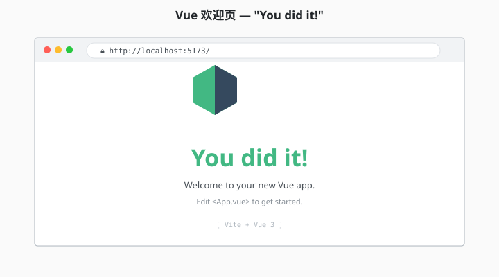
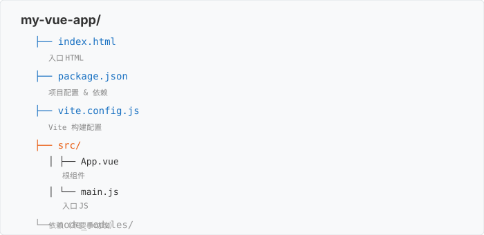
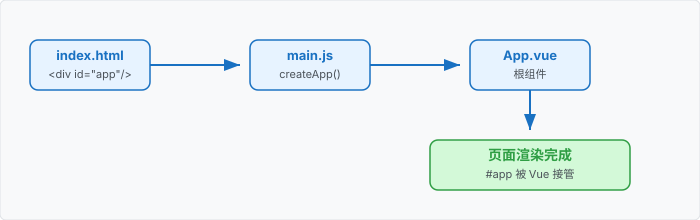

# 1.3 项目初始化：开干

> 章节：第 1 章 Vue 入门与准备
> 课时：1 课时

---

## 🎯 学习目标

学完这节，你将能够：

- ✅ 用 `npm create vue@latest` **创建 Vue 3 项目**
- ✅ 理解创建时的**每个选项**是干什么的
- ✅ 跑通 `npm run dev` **启动开发服务器**
- ✅ 在浏览器看到 **Vue 默认欢迎页**
- ✅ 知道**项目创建失败**怎么排查

---

## 🧠 思维导图


```text
1.3 项目初始化：开干
├── 创建项目
│   ├── 命令：npm create vue@latest
│   ├── 项目名（英文小写）
│   ├── 6 个选项（要不要 TypeScript / Router / Pinia 等）
│   └── 等待依赖安装
├── 项目结构
│   ├── 顶层文件（package.json / vite.config.js 等）
│   ├── src/ 目录（核心代码）
│   └── public/ 目录（静态资源）
├── 启动项目
│   ├── cd my-project
│   ├── npm install（已经装过可跳过）
│   └── npm run dev
└── 看到欢迎页
    ├── http://localhost:5173
    ├── 看到 Vue logo
    └── "You did it!"
```

---

工具装齐了，现在到了最激动的环节——创建你的第一个 Vue 项目。不过先别急着打开记事本从零写 `index.html`，很多新手会在这一步犯嘀咕："为什么不让我手写文件？脚手架帮我生成一堆看不懂的代码，我还能学会吗？"这节我们就用一个命令把项目跑起来，再逐个拆开看脚手架到底替我们做了什么。

---

## 🤔 一、为什么用脚手架？

**理论上你可以手写一个 Vue 项目**——但要配置：
- Vite（构建工具）
- 路由（如果需要）
- 状态管理（如果需要）
- TypeScript（如果需要）
- ESLint（代码规范）
- ……

**脚手架 = "项目模板"**——Vue 官方已经把这些都配好了，你**只挑你要的**，10 秒生成项目。

> 💬 **老师备注**：脚手架不是"黑盒"——下面我们会逐个解释每个选项是干什么的。

---

## 🛠 二、创建项目（完整流程）

### 步骤 1：进入工作目录

打开终端，`cd` 到你想放项目的位置：

```bash
# macOS / Linux
cd ~/Desktop

# Windows
cd C:\Users\你的用户名\Desktop
```

> 💬 **老师备注**：`cd` 是 change directory 的缩写。注意 macOS 的 `~` 表示"家目录"（`/Users/你的用户名`）。

### 步骤 2：运行创建命令

```bash
npm create vue@latest
```

这条命令会做两件事：
1. **下载** `create-vue`（Vue 官方脚手架工具）
2. **运行**它，向你提几个问题


### 步骤 3：回答 6 个问题

你会看到一系列提问，**挨个回答**：

| 提问 | 含义 | 本书选择 | 说明 |
|---|---|---|---|
| Project name | 项目名 | `my-vue-app` | **英文小写**，不要空格 |
| Add TypeScript? | 是否加 TS | **No** | 本书不教 TS |
| Add JSX Support? | 是否支持 JSX | **No** | 本书用模板语法 |
| Add Vue Router? | 是否加路由 | **No** | 第 10 章再学 |
| Add Pinia? | 是否加状态管理 | **No** | 第 11 章再学 |
| Add Vitest? | 是否加单元测试 | **No** | 本书不教测试 |
| Add an End-to-End Testing Solution? | 是否加 E2E 测试 | **No** | 同上 |
| Add ESLint? | 是否加代码规范 | **No** | 可选 |

> 💬 **老师备注**：第一次创建建议**全选 No**——把项目做"最小"，理解清楚再加东西。第 8 章后我们会教你按需添加。

### 步骤 4：进入项目 + 启动

```bash
# 进入项目目录
cd my-vue-app

# 安装依赖（首次需要，等 30-60 秒）
npm install

# 启动开发服务器
npm run dev
```

你会看到：

```bash
  VITE v5.x.x  ready in xxx ms

  ➜  Local:   http://localhost:5173/
  ➜  press h + enter to show help
```

### 步骤 5：打开浏览器

按提示打开 [http://localhost:5173/](http://localhost:5173/)——看到**官方欢迎页**就成功了！



> 💬 **老师备注**：`localhost:5173` 里的 `5173` 是 Vite 的默认端口。**不要关掉终端**——关了就停了。

---

## 🧠 三、项目结构详解

创建完项目后，`my-vue-app/` 长这样：

```text
my-vue-app/
├── .gitignore           # Git 忽略文件
├── index.html           # HTML 入口（整个项目唯一）
├── package.json         # 项目配置（依赖、脚本）
├── package-lock.json    # 依赖锁定文件
├── README.md            # 项目说明
├── vite.config.js       # Vite 构建配置
├── public/              # 静态资源（不会被构建）
│   └── favicon.ico
├── src/                 # 源代码 ⭐ 你的代码都在这
│   ├── assets/          # 图片、字体等
│   ├── components/      # 公共组件
│   ├── App.vue          # 根组件
│   └── main.js          # 入口 JS
└── node_modules/        # 依赖（自动生成，不要手动改）
```



> 💬 **老师备注**：
> - `node_modules/` 里有几百个包，**不要打开看**——会晕
> - `src/` 是你**唯一需要关心**的目录
> - `package.json` 是项目的"身份证"

---

## 📦 四、package.json 详解

打开 `package.json`，你会看到：

```json
{
  "name": "my-vue-app",      // 项目名
  "version": "0.0.0",        // 版本号
  "private": true,            // 私有项目（不发布到 npm）
  "type": "module",           // ES Module 模式
  "scripts": {
    "dev": "vite",            // 启动开发服务器
    "build": "vite build",    // 打包生产环境代码
    "preview": "vite preview" // 本地预览生产包
  },
  "dependencies": {           // 生产依赖（运行时需要）
    "vue": "^3.4.0"
  },
  "devDependencies": {        // 开发依赖（只在开发时用）
    "@vitejs/plugin-vue": "^5.0.0",
    "vite": "^5.0.0"
  }
}
```

**关键 scripts**：

| 命令 | 作用 |
|---|---|
| `npm run dev` | 启动开发服务器（日常写代码用） |
| `npm run build` | 打包生产代码（上线前用） |
| `npm run preview` | 本地预览生产包（看 build 后的效果） |

> 💬 **老师备注**：现在你只需要记 `npm run dev` 这一条。其他两条**上线部署章节（第 13.18）**会教。

---

## 🔍 五、main.js 详解

打开 `src/main.js`：

```javascript
// src/main.js —— 整个应用的入口
import { createApp } from 'vue'      // 1. 引入 Vue 的 createApp 函数
import App from './App.vue'           // 2. 引入根组件
import './assets/main.css'            // 3. 引入全局样式

// 4. 创建 Vue 应用实例，并把根组件挂载到 #app
createApp(App).mount('#app')
```

`index.html` 里的 `<div id="app"></div>` 就是 Vue 要"接管"的位置。



> 💬 **老师备注**：现在不用背 `main.js` 的每行代码——只要知道"这是入口"就行。第 4 章会展开讲组件注册。

---

## 🎨 六、App.vue 详解

打开 `src/App.vue`——你会看到 3 段：

```vue
<script setup>
// 第 1 段：JS 逻辑（暂空）
</script>

<template>
  <!-- 第 2 段：HTML 结构（这就是你看到的欢迎页） -->
  <div class="container">
    
    <h1>You did it!</h1>
    <p>...</p>
  </div>
</template>

<style scoped>
/* 第 3 段：CSS 样式（只作用于当前组件） */
.container { text-align: center; }
</style>
```

**3 段式**是 Vue 单文件组件（SFC）的标准结构：
- `<script setup>`：逻辑
- `<template>`：结构
- `<style scoped>`：样式

> 💬 **老师备注**：`<style scoped>` 里的 `scoped` 表示"这些样式只作用于当前组件，不会污染其他组件"——这是 Vue 的特色，第 2 章会深入讲。

---

## ⚠️ 七、常见问题

### 问题 1：端口 5173 被占用

**症状**：启动时报错 "Port 5173 is already in use"。

**修复**：
- 关掉其他占用端口的程序
- 或在 `vite.config.js` 里改端口（高级用法）

### 问题 2：创建时卡住

**症状**：`npm create vue@latest` 卡在 "Resolving packages"。

**修复**：
```bash
# 换国内镜像
npm config set registry https://registry.npmmirror.com
# 然后重新运行
```

### 问题 3：浏览器打不开 localhost:5173

**症状**：终端显示成功，但浏览器白屏。

**修复**：
1. 检查地址是不是 `http://localhost:5173/`（带 `http://` 和末尾斜杠）
2. 看看防火墙 / 代理设置
3. 用 `127.0.0.1:5173` 替代 `localhost:5173` 试试

### 问题 4：改代码不生效

**症状**：修改 `App.vue` 浏览器没反应。

**修复**：
- 确认终端还在运行（没关）
- 刷新浏览器（Ctrl+R / Cmd+R）
- 极端情况：重启 `npm run dev`

---

## 🧠 本节小结

- **创建命令**：`npm create vue@latest`，按提示回答 6 个问题，官方脚手架一键生成项目
- **启动三步**：`cd my-vue-app` → `npm install` → `npm run dev`，浏览器打开 `http://localhost:5173`
- **核心 3 文件**：`index.html` 唯一 HTML 入口、`src/main.js` JS 入口、`src/App.vue` 根组件
- **6 个选项别慌**：TypeScript / Router / Pinia 等都可以先选 No，第 3 章后再按需开启
- **常见坑**：端口被占用换端口、依赖下载慢换镜像、改了代码没反应先刷新

> 下一步：1.4 我们逐个看懂脚手架生成的项目结构，知道每个目录是干什么的。

---

## 📝 即时练习

**练习 1（动手操作）**：
按本节步骤，**创建你的第一个 Vue 项目**，项目名 `my-first-vue`。**6 个问题全选 No**。

启动 `npm run dev`，看到欢迎页后，**截图保存**。

**练习 2（动手操作）**：
打开 `src/App.vue`，**改一行**——把 `<h1>You did it!</h1>` 改成 `<h1>你好，我的第一个 Vue 应用！</h1>`。

**保存后浏览器会自动刷新**——你应该看到中文显示。

**练习 3（理解）**：
打开 `package.json`，回答：
- `"dependencies"` 里的 `vue` 版本是几？
- `"scripts"` 里 `dev` 跑的是什么命令？

---

## 📚 拓展阅读

- [Vue 官方 - 创建应用](https://cn.vuejs.org/guide/quick-start.html)
- [Vite 官方文档](https://cn.vitejs.dev/)
- [npm 官方文档](https://docs.npmjs.com/)

---

**（1.3 节结束，下一节 1.4 我们认识项目结构 →）**