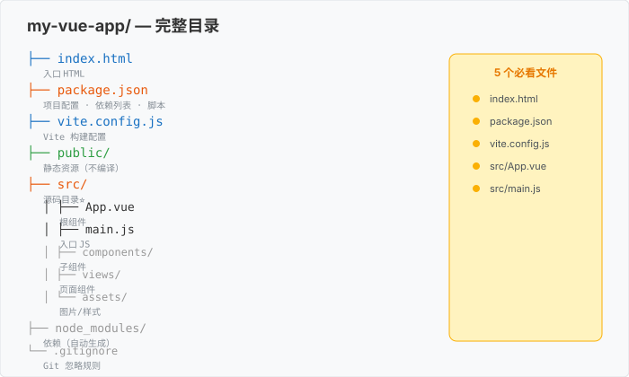

# 1.4 项目结构：认识新家

> 章节：第 1 章 Vue 入门与准备
> 课时：0.5 课时

---

## 🎯 学习目标

学完这节，你将能够：

- ✅ **理解** Vue 3 项目的**完整目录结构**
- ✅ 说出每个核心目录和文件的**作用**
- ✅ 区分 `src/` `public/` `node_modules/` 的区别
- ✅ 区分 `assets/` 和 `components/` 的存放规则

---

## 🧠 思维导图


```text
1.4 项目结构：认识新家
├── 顶层文件
│   ├── package.json（项目身份证）
│   ├── vite.config.js（构建配置）
│   ├── index.html（唯一 HTML）
│   └── .gitignore（Git 忽略）
├── src/（你的代码）
│   ├── main.js（入口 JS）
│   ├── App.vue（根组件）
│   ├── components/（公共组件）
│   ├── assets/（资源）
│   └── views/（页面级组件）
├── public/（静态资源）
│   └── favicon.ico
└── node_modules/（依赖，不动）
```

---

项目跑起来的那一刻，你看到浏览器里蹦出"Welcome to Your Vue.js App"，兴奋劲儿还没过，转头瞥见左侧文件树：`package.json`、`vite.config.js`、`node_modules`……密密麻麻几十个文件和目录，顿时有点慌——"我该改哪个？其他的能删吗？"别怕，这套结构不是给你下马威的，它就像搬进新家先看看每个房间的用途。这节带你花 5 分钟把"新家"逛明白。

---

## 🤔 一、为什么学项目结构？

**上一节我们用脚手架创建了项目，但**：
- `package.json` 里那一堆 `dependencies` 是啥？
- `src/` 和 `public/` 放啥不一样？
- `node_modules/` 为啥不能手动改？

**学完这节，你能在 5 分钟内把任意 Vue 项目"看懂一半"**。

---

## 🗂 二、完整目录树

打开你的 `my-vue-app/` 项目（在 VS Code 里 `File → Open Folder`），展开所有文件：

```text
my-vue-app/
├── .vscode/                  # VS Code 项目级配置（可选）
│   └── extensions.json       # 推荐插件列表
├── public/                   # 静态资源（不会被构建处理）
│   └── favicon.ico
├── src/                      # ⭐ 你的代码（唯一重要的目录）
│   ├── assets/               # 会被构建的资源
│   │   ├── main.css          # 全局 CSS
│   │   ├── base.css          # 基础样式
│   │   └── logo.svg          # 图片资源
│   ├── components/           # 公共组件
│   │   ├── HelloWorld.vue    # 示例组件
│   │   ├── TheWelcome.vue    # 欢迎页组件
│   │   └── ...
│   ├── router/               # 路由（如果选了 Vue Router）
│   ├── stores/               # Pinia store（如果选了 Pinia）
│   ├── views/                # 页面级组件
│   │   ├── HomeView.vue
│   │   └── AboutView.vue
│   ├── App.vue               # ⭐ 根组件
│   └── main.js               # ⭐ 入口 JS
├── .gitignore                # Git 忽略规则
├── index.html                # ⭐ 唯一 HTML 文件
├── package.json              # ⭐ 项目配置
├── package-lock.json         # 依赖锁定
├── README.md                 # 项目说明
└── vite.config.js            # ⭐ Vite 配置
```

> 💬 **老师备注**：**加粗的 5 个文件是"必看"**——其他文件 90% 时间不用碰。



---

## 📄 三、5 个必看文件详解

### 文件 1：`index.html`（HTML 入口）

整个项目**唯一**的 HTML 文件——其他都是 `.vue` 组件。

```html
<!DOCTYPE html>
<html lang="zh-CN">
  <head>
    <meta charset="UTF-8" />
    <link rel="icon" href="/favicon.ico" />
    <meta name="viewport" content="width=device-width, initial-scale=1.0" />
    <title>Vite App</title>
  </head>
  <body>
    <div id="app"></div>      <!-- Vue 挂载点 -->
    <script type="module" src="/src/main.js"></script>
  </body>
</html>
```

**关键点**：
- `<div id="app"></div>` 是 Vue 要"接管"的位置——所有 Vue 组件最终都渲染到这里
- `<script>` 引入 `main.js`——这是整个应用的入口

> 💬 **老师备注**：**不要在 `index.html` 里写业务 UI**——那是 Vue 组件的活。这里只放"骨架"。

### 文件 2：`src/main.js`（JS 入口）

```javascript
import { createApp } from 'vue'        // 1. 引入 Vue
import App from './App.vue'             // 2. 引入根组件
import './assets/main.css'              // 3. 引入全局样式

createApp(App).mount('#app')            // 4. 创建并挂载应用
```

**4 行代码干了 4 件事**：
1. 从 `vue` 包里引入 `createApp` 函数
2. 引入根组件 `App.vue`
3. 引入全局 CSS
4. 创建 Vue 应用实例，挂载到 `#app` 这个 DOM 上

### 文件 3：`src/App.vue`（根组件）

```vue
<script setup>
// 根组件的 JS 逻辑
import TheWelcome from './components/TheWelcome.vue'
</script>

<template>
  <!-- 整个页面的 HTML 结构 -->
  <TheWelcome />
</template>

<style scoped>
/* 根组件的样式（影响整个应用） */
</style>
```

**App.vue 是"空壳"**——它不做具体业务，只引用其他组件 + 整体布局。

> 💬 **老师备注**：第 3 章会深入讲"组件树"——App.vue 就是那棵树的"根"。

### 文件 4：`package.json`（项目配置）

```json
{
  "name": "my-vue-app",
  "private": true,
  "version": "0.0.0",
  "type": "module",
  "scripts": {
    "dev": "vite",
    "build": "vite build",
    "preview": "vite preview"
  },
  "dependencies": {
    "vue": "^3.4.0"
  },
  "devDependencies": {
    "@vitejs/plugin-vue": "^5.0.0",
    "vite": "^5.0.0"
  }
}
```

**核心字段**：
- `name`：项目名
- `scripts`：可执行命令
- `dependencies`：运行时依赖（部署时也要）
- `devDependencies`：开发时依赖（部署时可不要）

### 文件 5：`vite.config.js`（构建配置）

```javascript
import { fileURLToPath, URL } from 'node:url'
import { defineConfig } from 'vite'
import vue from '@vitejs/plugin-vue'

export default defineConfig({
  plugins: [vue()],
  resolve: {
    alias: {
      '@': fileURLToPath(new URL('./src', import.meta.url))
    }
  }
})
```

**核心作用**：
- 注册 Vue 插件
- 配置 `@` 指向 `src/`（这样你可以写 `import xxx from '@/components/Xxx.vue'`）

---

## 🗂 四、src/ 子目录分工

### `src/components/` —— 公共组件

放**可复用**的小组件，比如：
- `Button.vue`
- `Modal.vue`
- `Card.vue`

**判断标准**：**这个组件在 2 个以上页面用到** → 放 `components/`。只用 1 次 → 放对应页面的目录里。

### `src/views/` —— 页面级组件

放**对应路由**的页面，比如：
- `HomeView.vue`（路由 `/`）
- `AboutView.vue`（路由 `/about`）
- `UserProfileView.vue`（路由 `/user/:id`）

> 💬 **老师备注**：第 10 章路由会详细讲。现在你只要知道 **views/ 是"页面"，components/ 是"积木"**。
>
> ⚠️ 注意：**只有装了 Vue Router 才会自动建 `views/` 目录**。本书推荐"全选 No"的最小化脚手架，所以你的项目里**可能没有这个目录**——别担心，第 10 章会手把手教你建。

### `src/assets/` —— 资源文件

放**会被构建工具处理**的资源：
- 图片（会被压缩、加 hash）
- 全局 CSS
- 字体
- SVG

> 注意：`src/assets/main.css` 在 `main.js` 里被 `import`，**全局生效**。

### `src/router/`（如果装了 Vue Router）

路由配置：
- `index.js`——路由表

### `src/stores/`（如果装了 Pinia）

状态管理：
- `user.js`——用户状态
- `cart.js`——购物车状态

---

## 🗂 五、public/ vs src/assets/

这两个最容易搞混：

| 维度 | `public/` | `src/assets/` |
|---|---|---|
| 引用方式 | `` | `import logo from '@/assets/logo.svg'` |
| 构建处理 | ❌ 不处理，原样复制 | ✅ 会压缩、加 hash |
| 适合放 | 不会变的固定资源（favicon、robots.txt） | 会用 import 引用的资源 |
| 路径 | 用**绝对路径** `/xxx` | 用 **import 相对路径** |

**判断标准**：
- **要 import 引用** → 放 `src/assets/`
- **要写死在 HTML 里** → 放 `public/`

---

## 🗂 六、node_modules/

这个目录**装了几百个包**（Vue、Vite、各种工具）——**绝对不要手动改**。

**几个特点**：
- 体积大（通常 100-300 MB）
- 不会提交到 Git（在 `.gitignore` 里）
- 删除后用 `npm install` 重新下载

> 💬 **老师备注**：
> - 切换电脑 / 给同学代码 → 只需要给"非 node_modules 的文件"
> - 收到代码后 → `cd my-project && npm install` 一键恢复
> - 这就是 `package.json` 存在的意义——告诉 npm"我要哪些包"

---

## 🧠 本节小结

- **顶层 3 件套**：`package.json`（依赖清单）、`vite.config.js`（构建配置）、`index.html`（唯一入口）
- **src/ 三个核心**：`main.js` 入口、`App.vue` 根组件、`components/` 放可复用组件
- **src/ 常见分工**：`views/` 放页面级组件、`assets/` 放静态资源
- **public/ vs src/assets/**：public 原样拷贝不进构建流程，assets 会被打包工具处理
- **node_modules/ 别手改**：它是 `package.json` 的"投影"，删了重跑 `npm install` 就能恢复

---

## 📝 即时练习

**练习 1（动手操作）**：
打开你的 `my-vue-app` 项目，**说出**这 5 个文件的路径和作用：
1. `index.html` 在哪？它引用了哪个 JS？
2. `main.js` 调用的根组件是哪个文件？
3. `App.vue` 引用了哪些组件？
4. `package.json` 里的 `dev` 命令是干什么的？
5. `node_modules` 能手动改吗？

**练习 2（理解）**：
回答：以下文件应该放哪里？
- 一张公司 logo 图片
- 一个登录页组件
- 一个通用的"确认弹窗"组件
- 网站的 favicon

**练习 3（选做）**：
试着**删除** `node_modules/` 文件夹，然后 `npm install` 看会不会自动恢复。

---

## 📚 拓展阅读

- [Vite 项目结构](https://cn.vitejs.dev/guide/)
- [Vue 官方 - 项目结构建议](https://cn.vuejs.org/guide/scaling-up/folder-structure.html)
- [npm package.json 文档](https://docs.npmjs.com/cli/v10/configuring-npm/package-json)

---

**（1.4 节结束，下一节 1.5 我们写第一个组件 →）**