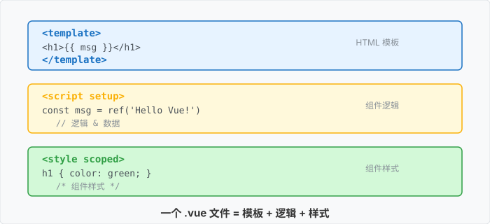
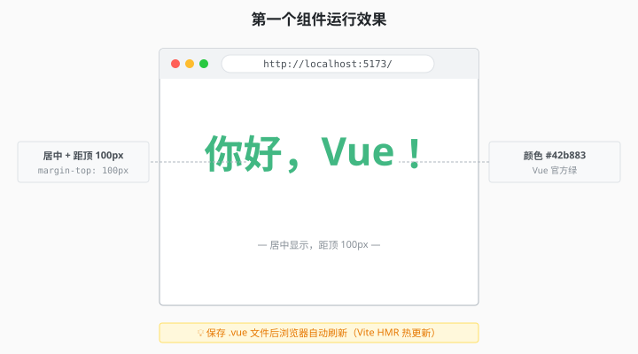
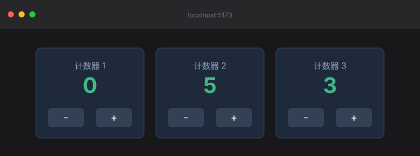

# 1.5 第一个组件：跑起来

> 章节：第 1 章 Vue 入门与准备
> 课时：0.5 课时

---

## 🎯 学习目标

学完这节，你将能够：

- ✅ **写**一个完整的 Vue 单文件组件（SFC）
- ✅ 理解 SFC 的 **3 段式结构**（script / template / style）
- ✅ 修改 `App.vue` 让页面显示**你的自定义内容**
- ✅ **保存后自动刷新**——见证 Vite 的魔法

---

## 🧠 思维导图


```text
1.5 第一个组件：跑起来
├── SFC 是什么
│   ├── Single-File Component
│   ├── 一个文件 = 一个组件
│   └── 3 段式结构
├── 实战 1：Hello Vue
│   ├── 改 App.vue
│   ├── 保存自动刷新
│   └── 浏览器看到效果
├── 实战 2：加个按钮
│   ├── 用 @click 绑事件
│   ├── 用 ref 做状态
│   └── 看到响应式
└── 实战 3：抽离组件
    ├── 新建 components/HelloWorld.vue
    ├── 在 App.vue 引用
    └── 理解组件复用
```

---

逛完"新家"，你知道了 `src/` 里躺着 `main.js` 和 `App.vue`，但还没真正动手写过东西。打开 `App.vue` 的那一刻，问题来了：这文件里怎么又是标签又是 `<script>` 又是 `<style>`？HTML 不像 HTML，JS 不像 JS？别慌，这正是 Vue 项目最常用的"单文件组件"格式，也是从"会看"到"会写"的分水岭。这节我们亲手改出第一个页面。

---

## 🤔 一、什么是 SFC？

**SFC = Single-File Component（单文件组件）**——一个 `.vue` 文件 = 一个组件。

```vue
<!-- 一个 SFC 的标准 3 段式结构 -->
<script setup>
// 第 1 段：JS 逻辑
// 导入其他组件、定义数据、函数等
</script>

<template>
  <!-- 第 2 段：HTML 结构（必填） -->
  <!-- 你看到的 UI 写在这里 -->
</template>

<style scoped>
/* 第 3 段：CSS 样式（可选） */
/* 加 scoped 表示"只作用于当前组件" */
</style>
```

**3 段的关系**：
- `<script>` 定义**数据 + 行为**
- `<template>` 把数据**渲染成 UI**
- `<style>` 给 UI**加样式**

> 💬 **老师备注**：`<script setup>` 是 Vue 3 的"语法糖"——让组件代码更简洁。本书所有代码都用这种写法。



---

## 🛠 二、实战 1：Hello Vue

### 目标

把默认欢迎页改成"你好，Vue!"——**全程 30 秒**。

### 步骤

打开 `src/App.vue`，**删掉所有内容**，替换成：

```
<script setup>
// 这里暂时空着
</script>

<template>
  <!-- 一个最简单的组件 -->
  <h1>你好，Vue！</h1>
</template>

<style scoped>
/* 加点样式让标题好看 */
h1 {
  color: #42b883;        /* Vue 官方绿 */
  text-align: center;    /* 居中 */
  margin-top: 100px;     /* 距离顶部 100px */
}
</style>
```

### 看效果

**保存文件**（Cmd+S / Ctrl+S）——**浏览器自动刷新**，你应该看到：

```text
                你好，Vue！
              （绿色、居中、距顶 100px）
```



> 💬 **老师备注**：你不需要**手动刷新浏览器**——Vite 的 HMR（热更新）会自动刷新。**你只管改代码，效果秒出**。

### 验证

- ✅ 标题显示"你好，Vue！"
- ✅ 文字是绿色（Vue 绿）
- ✅ 居中对齐

**这就是你写的第一个 Vue 组件！🎉**

---

## 🛠 三、实战 2：加个按钮

光文字太单调，我们加个**点一下就 +1 的按钮**——见证 Vue 的响应式。

### 步骤

把 `App.vue` 改成：

```vue
<script setup>
// 第 1 步：从 'vue' 引入 ref 函数
import { ref } from 'vue'

// 第 2 步：声明一个"响应式数据" count，初始值 0
// ref(0) 返回的是一个对象 { value: 0 }
// 在 <template> 里写 count，在 <script> 里要写 count.value
const count = ref(0)

// 第 3 步：写一个"点击 +1"的事件处理函数
function increment() {
  count.value++   // 改数据，UI 会自动更新
}
</script>

<template>
  <!--
    @click 是 Vue 的事件绑定语法（等价于 addEventListener）
    {{ count }} 是插值表达式，把 count.value 渲染到这
  -->
  <h1>你点了 {{ count }} 次</h1>
  <button @click="increment">点我 +1</button>
</template>

<style scoped>
h1 {
  text-align: center;
  color: #42b883;
  margin-top: 80px;
}
button {
  display: block;
  margin: 30px auto;
  padding: 10px 30px;
  font-size: 18px;
  background: #42b883;
  color: white;
  border: none;
  border-radius: 6px;
  cursor: pointer;
}
button:hover {
  background: #35495e;   /* 鼠标悬停变色 */
}
</style>
```

### 看效果

保存 → 浏览器自动刷新 → **点击按钮** → 数字 +1。

```text
        你点了 0 次
        [ 点我 +1 ]
        ↓ 点击
        你点了 1 次
        ↓ 点击
        你点了 2 次
        ↓ ...
```

> 💬 **老师备注**：
> - 你没改任何 DOM——Vue 自动帮你更新
> - 这就是**响应式**——`count.value` 改了，UI 自动跟着变
> - 第 5 章会深入讲原理

---

## 🛠 四、实战 3：抽离组件

按钮逻辑留在 `App.vue` 太挤，我们**把它抽出去**。

### 步骤 1：新建组件文件

在 `src/components/` 下新建 `CounterButton.vue`：

```
<!-- src/components/CounterButton.vue -->
<script setup>
// 第 1 步：导入 ref（响应式数据容器）
import { ref } from 'vue'

// 第 2 步：每个组件实例有"自己的" count（初始 0）
const count = ref(0)

// 第 3 步：点击 +1
function increment() {
  count.value++
}
</script>

<template>
  <div class="counter">
    <p>组件内部：{{ count }}</p>
    <button @click="increment">点我 +1</button>
  </div>
</template>

<style scoped>
.counter {
  text-align: center;
}
button {
  padding: 8px 24px;
  font-size: 16px;
  background: #42b883;
  color: white;
  border: none;
  border-radius: 6px;
  cursor: pointer;
}
</style>
```

> 💬 **老师备注**：本节用最简单的"每个组件一个独立 count"。**父组件传值**（`defineProps`）的用法见第 4 章。

### 步骤 2：在 App.vue 引用

修改 `src/App.vue`：

```vue
<script setup>
// 第 1 步：引入刚才写的子组件
import CounterButton from './components/CounterButton.vue'
</script>

<template>
  <h1>我的第一个 Vue 应用</h1>

  <!-- 第 2 步：在模板里像 HTML 标签一样使用 -->
  <!-- 用了 3 次，所以页面有 3 个独立计数器 -->
  <CounterButton />
  <CounterButton />
  <CounterButton />
</template>

<style scoped>
h1 {
  text-align: center;
  color: #42b883;
  margin-top: 60px;
}
</style>
```

### 看效果

保存 → 浏览器自动刷新 → 你应该看到 **3 个独立的计数器**：

```text
       我的第一个 Vue 应用

       组件内部：0   [点我 +1]
       组件内部：0   [点我 +1]
       组件内部：0   [点我 +1]

       （每个按钮独立计数，互不影响）
```

> 💬 **老师备注**：
> - 你用了**同一个组件 3 次**——这就是**组件复用**
> - 每个实例有**独立的状态**——这就是**组件实例化**
> - 第 3 章会深入讲组件



---

## 🔍 五、SFC 3 段式详解

### 第 1 段：`<script setup>`

```
<script setup>
import { ref } from 'vue'              // 1. 导入 Vue API
import OtherComponent from './Xxx.vue' // 2. 导入其他组件

const count = ref(0)                    // 3. 定义响应式数据
function increment() { count.value++ } // 4. 定义函数

// 所有这些"自动暴露"给 <template> 使用
</script>
```

**`setup` 是什么**：
- 这是 Vue 3 引入的"组合式 API 入口"
- 在 `<script setup>` 里写的所有东西，**自动可以在 `<template>` 里用**
- 不用 `return`、不用 `data()`、不用 `methods`（告别 Vue 2 时代）

### 第 2 段：`<template>`

```vue
<template>
  <!-- 必须是合法 HTML -->
  <!-- 必须有单个根元素（Vue 3 也支持多根，但建议单根） -->
  <div>
    <h1>{{ count }}</h1>
    <button @click="increment">+1</button>
  </div>
</template>
```

**关键规则**：
- 只能用单个根元素（除非用 Fragment）
- 可以用 `{{ }}` 插值
- 可以用 `v-if` / `v-for` 等指令（第 2、7 章）

### 第 3 段：`<style scoped>`

```
<style scoped>
/* 这些样式只作用于当前组件的 <template> */
/* 不会影响其他组件的同名 class */
.button { ... }
</style>
```

**`scoped` 是什么**：
- 给样式加"作用域"——只影响当前组件
- Vue 会在编译时给元素加 `data-v-xxx` 属性
- CSS 选择器会自动变成 `.button[data-v-xxx]`

> 💬 **老师备注**：第 2 章会深入讲 `<style scoped>` 的工作原理。

---

## ⚠️ 六、常见问题

### 问题 1：改完代码浏览器没反应

**修复**：
- 确认终端还在运行（没关）
- 手动刷新浏览器（Cmd+R / Ctrl+R）
- 极端情况：重启 `npm run dev`

### 问题 2：Volar 报红波浪线

**症状**：代码看着对，但编辑器有红线。

**修复**：
- 检查 `<script setup>` 里有没有 `import`
- 检查组件名是否正确（**组件名必须 PascalCase**：`CounterButton` 而不是 `counterButton`）

### 问题 3：找不到模块

**症状**：`Failed to resolve import ./components/CounterButton.vue`

**修复**：
- 检查文件路径
- 检查文件名大小写（macOS 默认不敏感，但 Vue 严格区分）
- 重新 `npm run dev`

---

## 🧠 本节小结

- **SFC 是什么**：一个 `.vue` 文件 = 一个组件，也叫单文件组件
- **3 段式结构**：`<script setup>` 写逻辑 + `<template>` 写 UI（必须有单根）+ `<style scoped>` 写局部样式
- **响应式初体验**：用 `ref()` 声明状态，改 `xxx.value` 页面自动更新，这就是 Vue 的"魔法"
- **组件复用**：同一个组件可以在 `App.vue` 里引用多次，每个实例状态互相独立
- **保存即刷新**：Vite 开发服务器会自动热更新，改完代码直接看效果

> 下一步：先完成 1.6 本章小测检验掌握度，再挑战 1.7 章末实战「个人名片站（P1）」——把 1.1-1.5 的基础拼成第一个能跑的小应用。

---

## 📝 即时练习

**练习 1（动手）**：
完成"实战 1"——把 `App.vue` 改成显示"你好，Vue!"。

**练习 2（动手）**：
完成"实战 2"——加个点击 +1 的按钮，验证响应式。

**练习 3（动手）**：
完成"实战 3"——抽离 `CounterButton` 组件，在 `App.vue` 用 3 次。

**练习 4（拓展）**：
试试在 `App.vue` 加一个 `<input v-model="message">`，然后用 `{{ message }}` 显示它。**保存后**在输入框打字，**看会不会同步更新**？

> 这是你第一次接触 `v-model` ——第 4 章会深入讲。

---

## 📚 拓展阅读

- [Vue 官方 - 单文件组件](https://cn.vuejs.org/guide/scaling-up/sfc.html)
- [Vue 官方 - `<script setup>`](https://cn.vuejs.org/api/sfc-script-setup.html)
- [Vue 官方 - 组合式 API 简介](https://cn.vuejs.org/guide/extras/composition-api-faq.html)

> 💬 **老师备注**：Vue 3.3+ 引入了 `defineOptions`，可以在 `<script setup>` 里声明组件名等选项，比如 `defineOptions({ name: 'MyComponent' })`。你现在不需要用，知道有这个功能就行，学到后面自然就懂了。

---

**（1.5 节结束，下一节 1.6 是本章小测 →）**