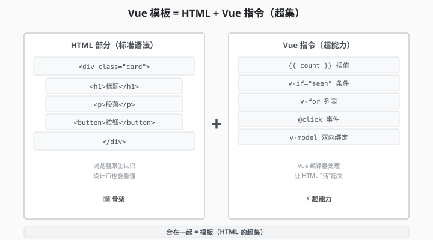
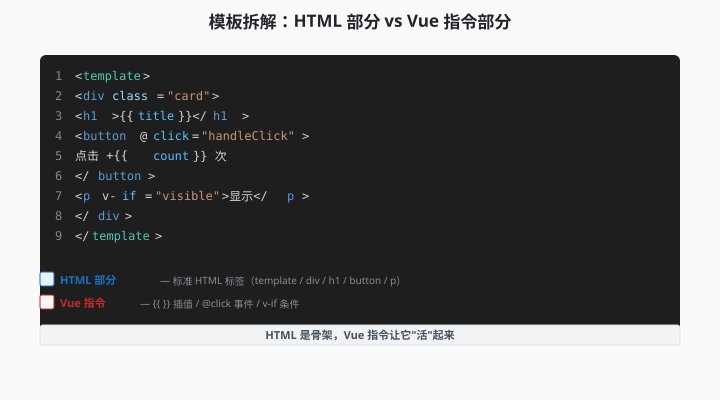
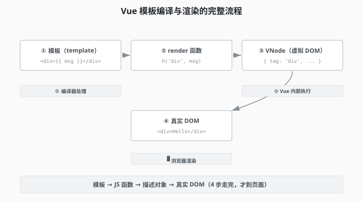

# 2.1 模板到底是个啥

> 章节：第 2 章 模板语法
> 课时：0.5 课时

---

## 🎯 学习目标

学完这节，你将能够：

- ✅ **理解**：Vue **模板**是什么（增强版 HTML）
- ✅ **理解**：模板**编译过程**（template → render function → VDOM）
- ✅ **了解**：为什么 Vue 要发明"模板"而不是直接用 JS

---

## 🧠 思维导图


```text
2.1 模板到底是个啥
├── 模板是什么
│   ├── HTML + Vue 指令的混合
│   ├── 本质是字符串
│   └── 编译后变成 JS 函数
├── 模板编译过程
│   ├── template（你写的）
│   ├── 编译（Vite + @vue/compiler-sfc）
│   ├── render function（JS 函数）
│   └── VNode（虚拟 DOM 节点）
├── 为什么用模板
│   ├── HTML 写 UI 更直观
│   ├── 设计师也能看懂
│   └── 比 JSX 学习成本低
└── 模板 vs JSX
    ├── 模板：HTML 为主
    ├── JSX：JS 为主
    └── 两者最终编译结果一样
```

---

第 1 章你已经把 Vue 应用跑起来了，也见过 `{{ message }}` 被替换成真实数据。那你想过没有——Vue 为什么不用 JS 直接生成页面，偏要发明一套看起来像 HTML 的「模板」？很多新手的第一反应是"模板不就是 HTML 吗？"，可真要动手写业务，又会发现它好像没那么简单，一会儿报错、一会儿不更新。这一节我们就先把模板到底是什么、它和 HTML/JSX 的关系搞清楚，心里有底了，后面写起来才不慌。

---

## 🤔 一、为什么 Vue 要发明"模板"？

我们先回到 Vue 是什么——**Vue 是一个 JavaScript 框架**。按理说，**用 JS 写 UI 应该最直接**。

但实际项目里，UI 长得像 HTML（`<div>`、`<h1>`、`<button>`），写起来应该是**结构化、可视化**的——**不是 JS 函数**。

Vue 给出的答案：**模板（template）**——**长得像 HTML，但有 Vue 自己的"超能力"**（指令、插值、事件绑定）。



> 💬 **老师备注**：你可以把"模板"理解为"**HTML 的超集**"——所有 HTML 语法都能用，**额外**加了 Vue 自己的指令（`v-if`、`v-for` 等）。

---

## 💡 二、模板长什么样？

```vue
<template>
  <div class="user-card">
    
    <h1>{{ user.name }}</h1>
    <p>{{ user.bio }}</p>
    <button v-if="user.isFriend" @click="sendMessage">
      发送消息
    </button>
  </div>
</template>
```

**这一段**结合了：
- **HTML 标签**：`<div>`、``、`<h1>`、`<p>`、`<button>`
- **Vue 插值**：`{{ user.name }}` —— 把数据塞到文本里
- **Vue 指令**：
  - `:src="user.avatar"` —— 属性绑定（`:`是`v-bind:`的简写）
  - `@click="sendMessage"` —— 事件绑定（`@`是`v-on:`的简写）
  - `v-if="user.isFriend"` —— 条件渲染

**如果你去掉 Vue 部分**（`{{ }}`、`:src`、`:alt`、`@click`、`v-if`），剩下的就是纯 HTML。**这就是"模板"**——**HTML + Vue 指令的混合**。



> 💬 **老师备注**：Vue 3 的模板跟 HTML 99% 一样——你学过的 HTML 标签**全部能直接用**。Vue 主要是加了**指令**（`v-` 开头）和**插值**（`{{ }}`）。

---

## 🔍 三、模板是怎么变成页面的？

**看起来很简单对吧？** 但你写的模板，**浏览器不认**——浏览器只认 HTML、CSS、JS。

所以 Vue 做了**编译**——把你写的"模板字符串"变成"JS 函数"。

**完整过程**：

```text
你写的（.vue 文件）
    ↓
[1] 模板编译（@vue/compiler-sfc）
    ↓
render function（JS 函数）
    ↓
[2] 执行 render function
    ↓
VNode（虚拟 DOM 节点）
    ↓
[3] 渲染到浏览器
    ↓
真实 DOM
```



> 💬 **老师备注**：**虚拟 DOM（VNode）**是 Vue 内部表示"页面应该长啥样"的 JS 对象。第 6 章会深入讲 VNode 和 diff 算法。

---

## 🛠 四、模板 vs JSX（哪个好？）

React 用 **JSX**——"在 JS 里写 HTML"。Vue 用**模板**——"在 HTML 里写 Vue 指令"。

**对比**：

| 维度 | 模板（Vue） | JSX（React） |
|---|---|---|
| **语法** | HTML 为主 | JS 为主 |
| **学习成本** | 低（前端都会 HTML） | 中（要学 JSX） |
| **设计师友好** | ✅ 直接看 | ❌ 要懂 JS |
| **灵活性** | ⚠️ 受限（HTML 能写啥才能写啥） | ✅ 高（JS 全部能力） |
| **编译产物** | render function | createElement 调用 |
| **最终结果** | 一样 | 一样 |

**Vue 也支持 JSX**——但**默认不推荐**。用模板能解决 95% 的场景。

> 💬 **老师备注**：**Vue 模板 ≈ JSX 的语法糖**——底层都是 render function。**选择哪个，看团队习惯**。本书用模板。

---

## ⚠️ 五、常见误区

### 误区 1：模板 = HTML

**真相**：模板**包含 HTML**，**但不止 HTML**。它有 Vue 指令（`v-if`、`v-for`）和插值（`{{ }}`），这些**浏览器不认**。

### 误区 2：模板只能在 `<template>` 标签里写

**真相**：**默认在 `<template>` 标签里**，但 Vue 3 支持**字符串模板**（用 `template: '...'` 选项）和 **JSX 模板**（用 render 函数）。

### 误区 3：模板编译很慢，影响性能

**真相**：**编译只跑一次**（Vite 启动时）。运行时只跑 render function——**非常快**。

---

## 🧠 本节小结

- **模板是什么**：HTML + Vue 指令的混合写法，本质是一段字符串，最终会被编译成 JS 函数
- **编译链路**：template → render function → VNode → DOM，模板不是"直接照着画"，而是先变成代码再渲染
- **为什么用模板**：写 UI 直观、设计师也能看懂、比 JSX 学习成本低
- **模板 vs JSX**：模板以 HTML 为主，JSX 以 JS 为主，两者最终编译结果一致

> 下一步：2.2 进入第一个真正会动的语法——插值 `{{ }}` 和指令 `v-bind`。

---

## 📝 即时练习

**练习 1（理解）**：
打开你的 `my-vue-app` 项目，**打开 `src/App.vue`**——找到 `<template>` 标签，里面是什么内容？**哪些是 HTML？哪些是 Vue 指令？**

**练习 2（动手）**：
在 `App.vue` 的 `<template>` 里加一行：

```
<h2>今天是 {{ new Date().toLocaleDateString() }}</h2>
```

**保存**——浏览器应该自动刷新，**显示今天的日期**。

**练习 3（拓展 / 选做）**：
打开浏览器 DevTools → Sources 标签 → 找到 `App.vue` 的**编译后代码**（Vite 会把 .vue 编译成 .js）。看看 render function 长什么样。

---

## 📚 拓展阅读

- [Vue 官方 - 模板语法](https://cn.vuejs.org/guide/essentials/template-syntax.html)
- [Vue 官方 - 渲染函数](https://cn.vuejs.org/guide/extras/render-function.html)
- [Vue 编译器 (@vue/compiler-sfc)](https://github.com/vuejs/core/tree/main/packages/compiler-sfc)

---

**（2.1 节结束，下一节 2.2 讲插值和指令 →）**