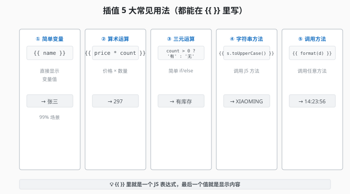
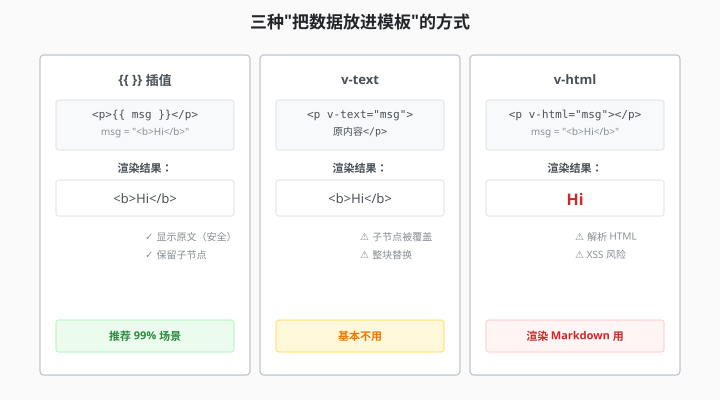
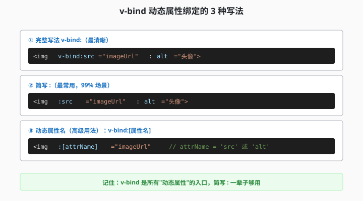

# 2.2 插值和指令

> 章节：第 2 章 模板语法
> 课时：1 课时

---

## 🎯 学习目标

- ✅ 熟练使用**插值** `{{ }}` 把数据渲染到模板
- ✅ 区分 **`v-text`** 和 **`v-html`** 的使用场景
- ✅ 理解 **`v-bind`**（`:属性`）做属性绑定
- ✅ 掌握模板里**写 JS 表达式**的规则

---

## 🧠 思维导图


```text
2.2 插值和指令
├── 插值（Mustache 语法）
│   ├── 基础用法：{{ 变量 }}
│   ├── 表达式：{{ count + 1 }}
│   └── 调用方法：{{ new Date() }}
├── v-text vs v-html
│   ├── v-text：纯文本（防 XSS）
│   └── v-html：解析 HTML（危险）
├── v-bind 属性绑定
│   ├── 简写：:src / :class / :style
│   ├── 动态 class：{ active: isActive }
│   └── 动态 style：{ color: textColor }
└── 模板表达式规则
    ├── ✅ 允许：变量、运算、函数调用
    └── ❌ 不允许：语句、if/for
```

---

上一节我们说了，模板是"增强版 HTML"。可它到底"增强"在哪？最直观的体验就是：你可以在页面里写 `{{ }}`，让 Vue 把数据自动填进去——不用手动查 DOM、改 innerHTML，数据一变页面自己就跟着变。但新手的困惑往往也在这里：`{{ }}` 能放什么？`v-text` 和 `v-html` 又有什么区别？什么时候该用 `v-bind`？这一节把插值和指令的基础用法一次讲透。

---

## 一、插值 `{{ }}`（Mustache 语法）

**Vue 模板**最基础的语法是**双花括号插值**——把 JS 表达式的结果渲染到 HTML 里。

### 基础用法

```vue
<script setup>
import { ref } from 'vue'

const name = ref('小明')
const age = ref(20)
</script>

<template>
  <h1>你好，{{ name }}！</h1>
  <p>你今年 {{ age }} 岁</p>
</template>
```

**渲染结果**：

```text
你好，小明！
你今年 20 岁
```

> 💬 **老师备注**：`{{ }}` 里写的是 **JS 表达式**，不是 HTML 文本。**Vue 会自动把表达式的结果转成字符串**渲染到模板。

### 表达式

`{{ }}` 里**可以是任意 JS 表达式**：

```
<script setup>
const price = 99
const count = 3
</script>

<template>
  <!-- 算术运算 -->
  <p>总价：{{ price * count }}</p>     <!-- 297 -->

  <!-- 三元运算 -->
  <p>{{ count > 0 ? '有库存' : '缺货' }}</p>

  <!-- 字符串方法 -->
  <p>{{ name.toUpperCase() }}</p>     <!-- XIAOMING -->

  <!-- 调用方法 -->
  <p>现在是 {{ new Date().toLocaleTimeString() }}</p>
</template>
```



### 不能写什么

`{{ }}` 里**只能写表达式**，**不能写语句**：

```vue
<!-- ❌ 错误：if/for 是语句 -->
{{ if (ok) { return 'yes' } }}
{{ for (let i = 0; i < 3; i++) { ... } }}

<!-- ❌ 错误：多行代码 -->
{{ const a = 1; const b = 2 }}

<!-- ✅ 正确：单个表达式 -->
{{ ok ? 'yes' : 'no' }}
{{ items.length }}
{{ [1, 2, 3].map(x => x * 2) }}
```

> 💬 **老师备注**：**复杂逻辑**用 `computed`（第 5 章会讲），不要在模板里写。

---

## 二、`v-text` 和 `v-html`

### `v-text`：纯文本

```
<template>
  <p v-text="message"></p>
  <!-- 等价于 <p>{{ message }}</p> -->
</template>
```

**特点**：Vue 自动**转义 HTML**——防 XSS 攻击。

```vue
<script setup>
const userInput = ref('<script>alert("XSS")</script>')
</script>

<template>
  <!-- 安全：显示原始字符串，不会执行脚本 -->
  <p v-text="userInput"></p>
  <!-- 显示：<script>alert("XSS")</script> -->
</template>
```

### `v-html`：解析 HTML

```
<template>
  <div v-html="richText"></div>
</template>
```

**特点**：**会解析 HTML 标签**——但不安全。

```vue
<script setup>
// ⚠️ 危险：用户输入的 HTML 永远不要用 v-html
const userInput = ref('')

// ✅ 安全：自己服务器来的富文本可以用
const articleContent = ref('<h2>标题</h2><p>正文...</p>')
</script>

<template>
  <!-- ❌ 危险：XSS 攻击 -->
  <div v-html="userInput"></div>

  <!-- ✅ 安全：受信任内容 -->
  <div v-html="articleContent"></div>
</template>
```

> 💬 **老师备注**：**99% 的场景用 `{{ }}` 就够了**。`v-html` 几乎不用——除非你要显示 Markdown 渲染后的内容（用 markdown 库渲染后用 v-html）。

三种"把数据放进模板"的方式对比：

| 维度 | `{{ }}` 插值 | `v-text` | `v-html` |
|---|---|---|---|
| **写法** | `` <p>{{ msg }}</p> `` | `` <p v-text="msg"></p> `` | `` <p v-html="msg"></p> `` |
| **渲染效果** | 纯文本 | 纯文本 | 解析 HTML |
| **XSS 风险** | ✅ 安全 | ✅ 安全 | ⚠️ **危险**（用户输入禁用） |
| **适用场景** | 日常 99% 场景 | 整块文本替换 | 渲染 Markdown/富文本 |
| **元素子节点** | 会保留 | 会被覆盖 | 会被覆盖 |

> 🧑 **小白**：那什么时候用 `v-text` 而不是 `{{ }}`？
> 👨🏫 **老湿**：基本没有。`{{ }}` 更灵活——它只替换自己那一个位置，`v-text` 会把整个元素内容清空重写。记住：**默认插值，特殊才用指令**。



---

## 三、`v-bind` 属性绑定

`v-bind` 把 **JS 表达式的结果**绑定到 **HTML 属性**。

### 基础用法

```
<script setup>
const imageUrl = ref('/logo.png')
const isActive = ref(true)
</script>

<template>
  <!-- 完整写法 -->
  

  <!-- 简写（推荐）：用冒号开头 -->
  

  <!-- 动态 class -->
  <div :class="{ active: isActive }">
    我是激活状态
  </div>
</template>
```

### 动态 class

**class 是最常用的动态属性**——根据状态切换样式：

```vue
<script setup>
const isActive = ref(false)
const hasError = ref(false)
</script>

<template>
  <!-- 单个 class 切换 -->
  <div :class="{ active: isActive }">...</div>

  <!-- 多个 class 组合 -->
  <div :class="{
    active: isActive,
    error: hasError,
    disabled: !isActive && !hasError
  }">...</div>

  <!-- 数组写法（无条件应用） -->
  <div :class="['btn', isActive && 'btn-active']">...</div>
</template>
```

### 动态 style

**style 也能动态绑定**：

```
<script setup>
const color = ref('#42b883')
const size = ref(20)
</script>

<template>
  <p :style="{
    color: color,
    fontSize: size + 'px',
    fontWeight: 'bold'
  }">
    动态样式
  </p>
</template>
```

> 💬 **老师备注**：style 里的 CSS 属性名要**驼峰式**（`font-size` → `fontSize`），或者用**引号**包起来（`'font-size'`）。



---

## 四、模板表达式规则总结

| ✅ 允许 | ❌ 不允许 |
|---|---|
| `{{ count }}` | `{{ var count = 1 }}` |
| `{{ count + 1 }}` | `{{ if (ok) { ... } }}` |
| `{{ isAdmin ? '是' : '否' }}` | `{{ for (i = 0; i < 3; i++) }}` |
| `{{ message.split('') }}` | `{{ switch(x) { case 1: ... } }}` |
| `{{ new Date() }}` | `{{ const a = 1; const b = 2 }}` |

**为什么限制这么多**？因为 Vue 要把模板**编译成函数**——函数里只能有表达式，不能有语句。

---

## 五、常见错误

### 错误 1：模板里写 if

```vue
<!-- ❌ 错 -->
{{ if (isLogin) { return '欢迎' } }}

<!-- ✅ 对：用三元 -->
{{ isLogin ? '欢迎' : '请登录' }}
```

### 错误 2：v-bind 写到字符串里

```
<!-- ❌ 错：src 是字符串 "imageUrl" -->


<!-- ✅ 对：加冒号，绑定 JS 表达式 -->

```

### 错误 3：class 写错位置

```vue
<!-- ❌ 错：class 是字符串 -->
<div class="{ active: isActive }">...</div>

<!-- ✅ 对：class 前加冒号变绑定 -->
<div :class="{ active: isActive }">...</div>
```

### 错误 4：v-html 用了用户输入

```
<!-- ❌ 危险：用户输入可能含 XSS -->
<div v-html="userInput"></div>

<!-- ✅ 安全：用 {{ }} 显示纯文本，或先 sanitize -->
<div>{{ userInput }}</div>
```

---

## 🧠 本节小结

- **插值 `{{ }}`**：把变量渲染成文本，里面可写简单 JS 表达式，是最常用的输出姿势
- **`v-text` 与 `v-html`**：前者是纯文本，后者解析 HTML——用 `v-html` 渲染用户输入有 XSS 风险，要谨慎
- **`v-bind`（简写 `:`）**：把属性、class、style 动态绑定到数据，组件传参全靠它
- **`v-on`（简写 `@`）**：绑定事件，下一节会正式展开
- **模板表达式守则**：只写表达式、不写语句，复杂逻辑交给 JS

---

## 📝 即时练习

**练习 1（动手）**：
在 `App.vue` 写一个"用户卡片"：

```vue
<script setup>
import { ref } from 'vue'
const name = ref('小明')
const age = ref(20)
const avatar = ref('https://via.placeholder.com/100')
</script>

<template>
  <div class="card">
    
    <h1>{{ name }}</h1>
    <p>{{ age }} 岁</p>
    <p>{{ age >= 18 ? '成年' : '未成年' }}</p>
  </div>
</template>

<style scoped>
.card { text-align: center; padding: 20px; border: 1px solid #ccc; border-radius: 8px; }
img { width: 100px; height: 100px; border-radius: 50%; }
</style>
```

**练习 2（理解）**：
回答：以下哪些应该用 `{{ }}`、哪些用 `v-html`、哪些用 `v-bind`？

- 显示用户名
- 显示用户头像 URL
- 显示富文本编辑器的内容
- 根据 isVIP 显示不同颜色

**练习 3（拓展）**：
用 `v-bind` 同时绑定 **class 和 style**，根据 `count > 5` 切换一个"高亮"样式。

---

## 📚 拓展阅读

- [Vue 官方 - 插值](https://cn.vuejs.org/guide/essentials/template-syntax.html#text-interpolation)
- [Vue 官方 - 原始 HTML](https://cn.vuejs.org/guide/essentials/template-syntax.html#raw-html)
- [Vue 官方 - Attribute 绑定](https://cn.vuejs.org/guide/essentials/template-syntax.html#attribute-bindings)
- [OWASP XSS 防护](https://owasp.org/www-community/attacks/xss/)

---

**（2.2 节结束，下一节 2.3 讲在模板里写 JS →）**