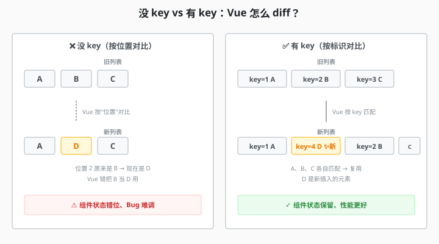

# 2.7 key 的作用与最佳实践

> 章节：第 2 章 模板语法与渲染
> 课时：3.5 课时（重点节）

---

## 🎯 学习目标

学完这节，你将能够：

- ✅ **理解**：Vue 的虚拟 DOM 和 Diff 算法基本概念
- ✅ **掌握**：`key` 在 Diff 中的"身份证"角色
- ✅ **说明**：为什么不用 index 做 key（用一个具体 Bug 演示）
- ✅ **对比**：有 key 和无 key 时 Vue Diff 行为的具体差异
- ✅ **理解**：`key` 值变化的后果（触发完整重建）
- ✅ **判断**：什么值能做 key、什么值不能做 key
- ✅ **掌握**：key 选值的优先级排序（数据库 id > nanoid > 组合键 > index）

---

## 🧠 思维导图

```text
2.7 key 的作用与最佳实践
├── 先看一个真实的 Bug
│   ├── index 做 key + 顶部插入 → 输入框内容错位
│   └── 原因：就地复用策略，真实 DOM 状态没跟着数据走
├── 为什么需要 key？
│   ├── Vue 的虚拟 DOM：用 JS 对象描述页面
│   ├── Diff 算法：对比新旧 VNode，找最小更新集合
│   └── 没有 key：按位置（index）对比，容易错位
├── key 是怎么工作的
│   ├── key = 节点的"身份证"
│   ├── 按 key 匹配新旧节点 → 移动而非重建
│   └── 没匹配上 → 新增/删除
├── 有 key vs 无 key
│   ├── 无 key：就地复用，子组件状态串位
│   ├── 有 key：按 key 移动，状态跟随数据走
│   └── key 值变了：旧组件销毁 + 新组件创建
├── key 选值的最佳实践
│   ├── 好 key 三标准：唯一性 / 稳定性 / 可预测性
│   ├── 优先级：数据库 id > nanoid > 组合键 > index
│   └── 常见错误：index / Math.random() / Date.now() / 不传 key
├── 性能分析
│   ├── 有 key：O(n)
│   └── 没 key：O(n²)（最坏情况）
└── 本节小结
    └── key 是身份证，index 是门牌号
```

---

上一节我们用 `v-for` 渲染列表时，几乎每个示例都加了 `:key`，但你可能只是照着写，并不知道它到底在干什么。直到某一天你发现：往列表顶部插入一条数据后，输入框里的内容竟然"串位"了！这一节我们就从一个真实的 Bug 出发，彻底搞懂 key 的原理——为什么它是 Diff 算法的"身份证"，为什么用 index 当 key 会踩坑。

---

## 🤔 一、先看一个真实的 Bug

```vue
<script setup>
import { ref } from 'vue'

const list = ref([
  { id: 1, name: '张三' },
  { id: 2, name: '李四' },
  { id: 3, name: '王五' },
])

function addToTop() {
  list.value.unshift({ id: Date.now(), name: '新人' })
}
</script>

<template>
  <!-- ⚠️ 故意用 index 做 key -->
  <div v-for="(item, index) in list" :key="index">
    <input v-model="item.name" />
    {{ item.name }}
  </div>

  <button @click="addToTop">在顶部插入一条</button>
</template>
```

你先在第二行（李四）的输入框中随便打几个字，然后点按钮在顶部插入一条。观察一下：**你刚在"李四"输入框打的字，跑到了"张三"的框里！**

这就是用 `index` 做 key 的经典 Bug。

---

## 💡 二、为什么需要 key？

**核心问题**：列表变化时，Vue 怎么知道**哪些元素是"同一个"**？

```js
// 旧列表：[A, B, C]
// 新列表：[A, B, D, C]   ← 在 B 和 C 之间插入 D
```

**Vue 怎么决定**：
- A 还是 A（位置没变）
- B 还是 B（位置没变）
- C 是"C 移到末尾"还是"被替换"？
- D 是新增还是替换了 C？

**没 key 时**：Vue 用**位置**对比——会把 C 当成"原 C"，新增 D 位置——**错位**。

**有 key 时**：Vue 用 key 对比——能正确识别"哪些是新增、哪些是移位"。



要理解这个 Bug，你得先知道 Vue 是怎么更新 DOM 的。

### 2.1 虚拟 DOM 和 Diff 算法（极简版）

**浏览器**渲染 DOM 代价很大（重排、重绘）。Vue 不会**直接操作 DOM**——先用 JS 对象描述"页面长啥样"。

```js
// 虚拟 DOM 节点（简化）
const vnode = {
  tag: 'li',
  props: { key: 1, class: 'item' },
  children: ['苹果']
}
```

**Vue 内部流程**：
```text
数据变化
  ↓
生成新的 VNode 树
  ↓
[diff 算法] 对比新旧 VNode
  ↓
找出"需要改的最小集合"
  ↓
只更新那些 DOM
```

列表 Diff 是这个过程中最精妙的部分。假设你有：

```
旧列表：[A, B, C, D]
新列表：[B, A, D, E]
```

人类一看就知道："C 没了，E 是新的，B 和 A 调换了位置"。但 Vue 没有"眼睛"，它只能按某种算法来判断。

### 2.2 没有 key 时：就地复用策略

Vue 默认采用**就地复用**策略——尽量不创建/销毁节点，而是"就地更新"内容。

```text
旧：[A, B, C, D]
新：[B, A, D, E]

Vue 的"无 key"处理：
  节点0: A → 更新为 B   （复用原 A 的 DOM，改文字）
  节点1: B → 更新为 A   （复用原 B 的 DOM，改文字）
  节点2: C → 更新为 D   （复用原 C 的 DOM，改文字）
  节点3: D → 更新为 E   （复用原 D 的 DOM，改文字）
```

所有节点都**没有被移动**，只是内容被覆盖了。对于纯文本列表没问题，但如果有 `<input>` 输入框：

- 输入框的内容不属于 Vue 的响应式数据，而是**真实 DOM 自身的状态**
- Vue 只改了文字没动 DOM 结构 → 输入框的 DOM 没变 → 输入的内容留在原位置
- 结果：内容"错位"了

**没有 key 时**：diff 算法只能用**位置**（index）对比——容易错。

---

## 🛠 三、key 是怎么工作的？

当你加了 `:key="item.id"` 后，Vue 的 Diff 策略变了：

```text
旧：key:1(A)  key:2(B)  key:3(C)  key:4(D)
新：key:2(B)  key:1(A)  key:4(D)  key:5(E)

Vue 按 key 匹配：
  key:2 匹配  →  移动位置（DOM 挪过去）
  key:1 匹配  →  移动位置
  key:4 匹配  →  保持
  key:5 新    →  创建新 DOM
  key:3 不在新列表  →  删除 DOM
```

key 就像一个**身份证号**——不管节点在列表里怎么挪位置，身份证号不变，Vue 就能认出"这是同一个节点"，然后正确地**移动而非重建**它。输入框作为真实 DOM 的一部分跟着一起移动，内容就不会错位了。

### 3.1 key = index 为什么等于没加？

回到开头的 Bug：

```
<!-- 第一次渲染 -->
<div :key="0">张三</div>   <!-- index 0 -->
<div :key="1">李四</div>   <!-- index 1 -->
<div :key="2">王五</div>   <!-- index 2 -->

<!-- 在顶部插入"新人"后 -->
<div :key="0">新人</div>   <!-- 原来是张三 -->
<div :key="1">张三</div>   <!-- 原来是李四 -->
<div :key="2">李四</div>   <!-- 原来是王五 -->
<div :key="3">王五</div>   <!-- 新的 -->
```

Vue 按 key 匹配：`key:0` 对 `key:0`（匹配！但内容是"新人"vs"张三"）→ **就地更新文字**，DOM 没动！所以"张三"输入框里的字留在了原本"李四"的位置。

**用 index 做 key，和在列表中间插入/删除数据，本质上是相互矛盾的**——每次操作后 index 都会整体偏移，key 就失去了唯一标识的意义。

> 💬 **老师备注**：唯一的例外是：列表**永远不会**在列表中间插入或删除，只在末尾追加，且没有排序、没有筛选。但谁敢打包票"永远不会"？所以一律用唯一 id，别赌。

### 3.2 有 key vs 无 key 的 diff 行为

把两种行为摆在一起对比，差异一目了然：

| 对比场景 | 无 key（按位置对比） | 有 key（按唯一标识对比） |
|---|---|---|
| 尾部追加 | 复用旧节点 + 新增 | 复用旧节点 + 新增 |
| 中间插入 | 后续节点被逐个"改内容"，状态错乱 | 精准识别插入点，其余复用 |
| 删除中间项 | 后续节点被误复用，状态串位 | 精准删除目标，其余复用 |
| 重排顺序 | 节点被逐个改内容，性能差 | 直接移动节点，性能好 |
| 内容更新 | 能更新 | 能更新，且能保持组件内部状态 |

---

## 🆚 四、有 key vs 无 key：实战对比

上节我们看了输入框 Bug，这节我们把它放大：不只是输入框，而是**带内部状态的子组件**。

考虑一个场景：你有一个待办列表，每条待办是一个 `<TodoItem>` 组件，组件内部有自己的状态（比如是否在编辑中）。当列表顺序变化时，编辑状态会跟着 index 走（错位），还是跟着数据走（正确）？


### 4.1 先定义子组件

```vue
<!-- TodoItem.vue -->
<script setup>
import { ref, onMounted, onUnmounted } from 'vue'

const props = defineProps({
  id: Number,
  text: String,
  done: Boolean
})

const editing = ref(false)

// 组件挂载
onMounted(() => {
  console.log(`[TodoItem ${props.id}] 挂载`)
})

// 组件卸载
onUnmounted(() => {
  console.log(`[TodoItem ${props.id}] 卸载`)
})

function toggleEdit() {
  editing.value = !editing.value
}
</script>

<template>
  <div :class="{ done: done }">
    <span v-if="!editing">{{ text }}</span>
    <input v-else v-model="text" />
    <button @click="toggleEdit">
      {{ editing ? '保存' : '编辑' }}
    </button>
  </div>
</template>
```

### 4.2 父组件 —— 无 key 版本（Bug）

```
<script setup>
import { ref } from 'vue'
import TodoItem from './TodoItem.vue'

const todos = ref([
  { id: 1, text: '写作业', done: false },
  { id: 2, text: '跑步', done: true },
  { id: 3, text: '看书', done: false },
])

function shuffle() {
  // Fisher-Yates 洗牌
  const arr = [...todos.value]
  for (let i = arr.length - 1; i > 0; i--) {
    const j = Math.floor(Math.random() * (i + 1))
    ;[arr[i], arr[j]] = [arr[j], arr[i]]
  }
  todos.value = arr
}
</script>

<template>
  <!-- ❌ 无 key -->
  <TodoItem
    v-for="todo in todos"
    :id="todo.id"
    :text="todo.text"
    :done="todo.done"
  />

  <button @click="shuffle">随机打乱顺序</button>
</template>
```

运行它，先把"写作业"那条点进编辑模式，然后点"随机打乱"。你会发现：**编辑状态留在了原位，但文字已经变成其他内容了！**

控制台日志也印证了这一点：没有任何 `onUnmounted` / `onMounted` 输出——Vue 没重建组件，只是改了传入的 props。

### 4.3 父组件 —— 有 key 版本（正确）

```vue
<template>
  <!-- ✅ 有 key -->
  <TodoItem
    v-for="todo in todos"
    :key="todo.id"
    :id="todo.id"
    :text="todo.text"
    :done="todo.done"
  />

  <button @click="shuffle">随机打乱顺序</button>
</template>
```

现在再点编辑 → 打乱，编辑状态**正确跟随了数据**——你在编辑"写作业"，打乱后它还是"写作业"。

控制台也无卸载日志：Vue 通过 key 匹配到了这些组件，正确地**移动了 DOM 位置**，组件实例内部的状态完好无损。

### 4.4 key = id 变化的副作用

`key` 值变了会发生什么？

```
<!-- 当 post.id 从 1 变成 2 时 -->
<BlogPost :key="post.id" :title="post.title" />
```

- 旧 key=1 在新虚拟 DOM 中不存在 → **组件被销毁**（触发 `onUnmounted`）
- 新 key=2 在旧虚拟 DOM 中不存在 → **组件从头创建**（触发 `setup` → `onMounted`）
- 组件内部所有状态丢失（`ref`、`computed`、输入框内容……全部重置）

这个"副作用"在某些场景反而是有用的：

```vue
<!-- 强制重新初始化表单 -->
<UserForm :key="userId" :user-id="userId" />

<!-- 切换用户时，表单自动清空重置 -->
```

> 💬 **老师备注**：`key` 值变了 = "这个组件已经不是同一个人了，Vue 请销毁旧的建新的"。这是 Vue 里为数不多的、可以"手动"强制重新渲染的方式。

### 4.5 对比总结

| | 无 key | 有 key（唯一 id） | key 值变了 |
|---|---|---|---|
| Diff 策略 | 就地复用 | 按 key 匹配 | 旧销毁 + 新创建 |
| DOM 操作 | 改文本，不动结构 | 移动 DOM 节点 | 删掉重建 |
| 子组件状态 | 串位（Bug） | 跟随数据走 | 全部重置 |
| 生命周期 | 不触发 | 不触发（移动） | `onUnmounted` → `onMounted` |
| 适用场景 | 无状态纯展示 | **所有列表（推荐）** | 强制重新初始化 |

---

## ⚠️ 五、key 的常见误解

| 误解 | 真相 |
|---|---|
| "加了 key 渲染更快" | key 主要是保证**正确性**，不是性能银弹 |
| "key 可以是随机数" | `:key="Math.random()"` 等于全部重建，比不加还差 |
| "不传 key 也行，Vue 有默认行为" | 可以但不推荐，容易出隐性 Bug |
| "反正加了 key 就行，随便加" | `Math.random()` 做 key 还不如不加——每次全部销毁重建，性能最差 |
| "我的列表很简单，不会出 Bug" | "简单"是指现在。将来需求变了、在中间插入了一条，这个假设就塌了 |
| "我用 `nanoid()` 在模板里生成 key" | `nanoid()` 必须在**数据创建时**调用并存到字段里，模板里的表达式每次渲染都会执行 |

---

## 🎯 六、key 选值的最佳实践

### 6.1 好 key 的三个标准

在你选 key 的时候，问自己三个问题：

| 标准 | 问题 | 不合格的例子 |
|---|---|---|
| **唯一性** | 这个值能保证列表中不重复吗？ | 用 `name`，但可能同名 |
| **稳定性** | 下次渲染同一个数据时，这个值会变吗？ | 用 `index`，插入后全变 |
| **可预测性** | 我看到这个 key，能准确知道它指向哪条数据吗？ | 用随机数，每次不同 |

### 6.2 key 选值优先级

**🥇 第一选择：数据库唯一 ID**

```vue
<!-- 后端返回 { id: 1, title: "..." } -->
<div v-for="post in posts" :key="post.id">
  {{ post.title }}
</div>
```

**条件**：后端一定返回唯一 `id` 字段（通常是自增主键或 UUID）。这是**最佳选择**——唯一、稳定、可预测，三个标准全满足。

**🥈 第二选择：前端生成唯一 ID**

如果后端没给 id，**在数据创建时就生成一个**：

```
<script setup>
import { ref } from 'vue'

// 简易唯一 ID 生成器
let nextId = 0
function generateId() {
  return `todo_${++nextId}`
}

const todos = ref([])

function addTodo(text) {
  todos.value.push({
    id: generateId(),  // ← 关键：创建时就带上唯一 id
    text,
    done: false
  })
}
</script>

<template>
  <div v-for="todo in todos" :key="todo.id">
    {{ todo.text }}
  </div>
</template>
```

> 💬 **老师备注**：实际项目中推荐用 `nanoid`（一个轻量唯一 ID 库）：`npm install nanoid`，然后 `import { nanoid } from 'nanoid'`，一条 `nanoid()` 就能生成一个全球唯一的字符串。

**🥉 第三选择：组合键**

当单一字段不够唯一时，用组合字符串：

```vue
<!-- 同一类型内 name 唯一，但不同类型可能重名 -->
<div v-for="item in mixedList" :key="`${item.type}-${item.name}`">
  {{ item.name }}
</div>
```

**⚠️ 第四选择：字符串/数字唯一值**

```
<!-- 如果每个 name 确实全局唯一且永不改变 -->
<li v-for="city in cities" :key="city.name">{{ city }}</li>
```

**前提**：你 100% 确定这些值唯一且不会变。城市名还行，学生姓名就危险了（会有重名）。

**❌ 绝不使用**

| 错误 key | 原因 |
|---|---|
| `:key="index"` | 列表增删后 index 偏移，本节前面已演示 |
| `:key="Math.random()"` | 每次渲染都变，全部重建 |
| `:key="Date.now()"` | 同上 |
| `:key="JSON.stringify(item)"` | 性能差，且对象属性变化时 key 会变（反而可能不是你想要的） |
| 不传 key | Vue 隐式用 index，和显式写 index 一样有问题 |

### 6.3 实战：7 个 key 写法诊断

下面是一份"key 诊断清单"，你能指出每个写法的问题吗？（做完再看答案）

| # | 写法 | 场景 |
|---|---|---|
| 1 | `:key="index"` | 从后端获取的动态列表 |
| 2 | `:key="item.id"` | 后端返回了 id |
| 3 | `:key="nanoid()"` | 直接在模板里调用 |
| 4 | `:key="item.name"` | 学生名单 |
| 5 | `:key="`${item.type}_${item.id}`"` | 混合列表（文章 + 视频） |
| 6 | `:key="item.createTime"` | 消息列表 |
| 7 | 不写 `:key` | Todo 列表 |

**答案**：

| # | 诊断 | 说明 |
|---|---|---|
| 1 | ❌ | index 在动态列表中会偏移 |
| 2 | ✅ | 最佳实践 |
| 3 | ❌ | 每次渲染都生成新 key → 全部重建 |
| 4 | ❌ | 重名风险，可能出现同名 key |
| 5 | ✅ | 组合键，兼顾类型和 id，合理 |
| 6 | ❌ | 时间精度不够可能冲突（同一毫秒多条消息） |
| 7 | ❌ | 等于隐式 index，动态列表会出问题 |

### 6.4 不同数据源的选择策略

| 数据来源 | 推荐 key |
|---|---|
| 后端数据库（有自增 ID） | `item.id` |
| 后端数据库（UUID） | `item.id` |
| 前端创建（无后端） | 创建时用 `nanoid()` 生成唯一 `id` |
| 纯展示静态配置（如省市区列表） | `item.code` 或 `item.name`（确保唯一且不增删） |

---

## 📊 七、性能分析

**有 key** 的 diff 复杂度：O(n)
**没 key**：退化为 O(n²)（最坏情况）

```js
// 没 key：每个旧元素都要跟每个新元素对比
// 100 个元素 → 10000 次对比

// 有 key：直接 hash 查找
// 100 个元素 → 100 次对比
```

> 💬 **老师备注**：**性能差异**在小列表不明显，大列表（1000+）时**有 key 明显更快**。

---

## 🧠 本节小结

- **key 是"身份证"**：Vue 靠它在 Diff 中识别节点身份，同列表内必须唯一且稳定
- **为什么不能只用 index**：中间插入/删除时 index 会"串号"，导致状态错位（输入框内容串行）
- **key 值变化 = 重建**：`<Comp :key="id" />` 可用来强制重置组件状态
- **好 key 三标准**：唯一性、稳定性、可预测性；优先级为 数据库 id > nanoid > 组合键 > index
- **别用**：`Math.random()` / `Date.now()` / 不传 key——每次渲染都重建，性能与状态全崩

> 下一步：2.8 讲 `v-if` 与 `v-for` 的正确组合姿势，2.9 用 `v-memo` 加速大列表。

---

## 📝 即时练习

**练习 1（动手）**：
把本节的 Bug 代码复制到你的项目里跑一遍，亲眼看到输入框内容错位的问题，然后把 `:key="index"` 改成 `:key="item.id"`，观察修复效果。

**练习 2（动手）**：
把本节 `TodoItem` 示例完整复制到你的项目里，分别运行无 key 和有 key 两个版本，记录控制台日志差异。

**练习 3（代码审查）**：
找出以下代码中的 key 问题并修复：

```
<div v-for="msg in messages" :key="msg.time">
<div v-for="tag in tags" :key="Math.random()">
<div v-for="(item, i) in items">
```

**练习 4（思考）**：
`v-for` 循环渲染纯文本列表（没有子组件、没有输入框），不加 key 会出问题吗？为什么 Vue 官方还是建议加？

---

## 📚 拓展阅读

- [Vue 3 官方文档 - key 的特殊属性](https://cn.vuejs.org/api/built-in-special-attributes.html#key)
- [Vue 3 官方文档 - 维护状态：key](https://cn.vuejs.org/guide/essentials/list.html#maintaining-state-with-key)
- [Vue 3 风格指南 - key](https://cn.vuejs.org/style-guide/rules-essential.html#use-keyed-v-for)
- [nanoid 官方文档](https://github.com/ai/nanoid)
- [React vs Vue：key 的设计哲学](https://www.zhihu.com/question/266488166)

---

**（2.7 节结束，下一节 2.8 讲列表与条件的组合用法，2.9 讲 v-memo 渲染加速 →）**
