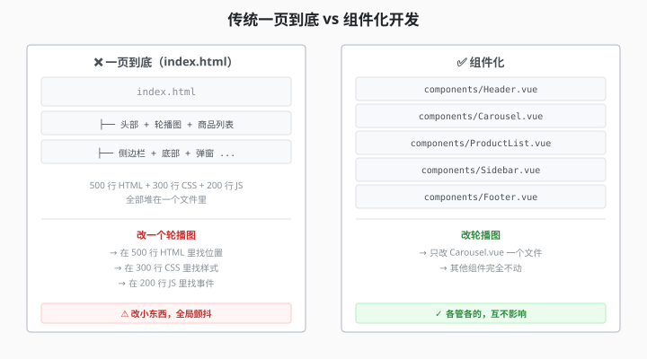

# 3.1 组件到底是个啥

> 章节：第 3 章 组件化思想
> 课时：1 课时

---

## 🎯 学习目标

学完这节，你将能够：

- ✅ **理解**：组件到底是什么（不是"控件"，是"积木"）
- ✅ **理解**：组件化开发 vs 传统页面开发的核心区别
- ✅ **掌握**：组件的三大构成（模板 + 逻辑 + 样式）
- ✅ **上手**：写一个真正的单文件组件（SFC）

---

## 🧠 思维导图

```text
3.1 组件到底是个啥
├── 组件的本质
│   ├── 不是"控件"，是"积木"
│   ├── 一个组件 = 一段独立的 UI + 逻辑 + 样式
│   └── 组件可以嵌套组合
├── 为什么需要组件
│   ├── 传统页面开发：一页到底式
│   ├── 组件化开发：搭积木式
│   └── 好处：复用、隔离、独立测试
├── 组件长什么样
│   ├── .vue 单文件组件（SFC）
│   ├── <template>：长相
│   ├── <script setup>：逻辑
│   └── <style scoped>：样式
├── 组件的生命周期
│   ├── 创建（挂载）
│   ├── 更新
│   └── 销毁（卸载）
└── 组件的粒度
    ├── 页面级组件（Page）
    ├── 区块级组件（Section）
    └── 原子级组件（Button、Input）
```

想象一下：学完模板语法后，你把整个页面全写进一个文件——列表、弹窗、页脚堆在一起，模板三千行，改一个按钮都要滚半天。同一个"课程卡片"要在三个页面各用一遍，你只能复制粘贴三份，改样式得改三处。Vue 解决这种"页面越写越大、代码越抄越乱"的方案，就是本节主角——组件（Component）。

---

## 🤔 一、组件的本质：不是"控件"，是"积木"

### 从一页到底到搭积木

早期（甚至现在）很多网站开发是这样的：

```text
index.html
├── 头部（导航栏）
├── 轮播图
├── 商品列表
├── 侧边栏
├── 底部（版权信息）
└── 弹窗
```

**所有代码全写在一个文件里**——HTML 几百行、CSS 几百行、JS 几百行。这叫**"一页到底式"开发**。

改一个轮播图？你可能要在 500 行 HTML 里找到那一块，在 300 行 CSS 里找相关样式，在 200 行 JS 里找事件绑定——**改一个小东西，全局颤抖**。



> 💬 **老师备注**：你有没有遇到过这种情况——改一个按钮的样式，结果另一个页面也跟着变了（或者没变）？这就是"一页到底式"的典型问题：**样式污染**和**逻辑耦合**。

**组件化开发**把这堆大杂烩拆成小块：

```text
App.vue
├── <AppHeader />      ← 头部组件（只管导航）
├── <Banner />         ← 轮播图组件（只管轮播）
├── <ProductList />    ← 商品列表组件（只管商品）
│   ├── <ProductCard />  ← 单个商品卡片（只管一个商品）
│   └── <ProductCard />
├── <Sidebar />        ← 侧边栏组件（只管侧边栏）
├── <AppFooter />      ← 底栏组件（只管底部）
└── <Modal />          ← 弹窗组件（只管弹窗）
```

每个组件**只管自己那一块**，组件之间可以**嵌套组合**，可以**独立开发、测试、复用**。

> 💬 **老师备注**：你可以把"组件"理解为**乐高积木**——每个积木独立，但可以拼出千变万化的东西。**大型应用是靠"搭积木"搭出来的，不是靠"一块大板子"刻出来的。**

### 组件的正式定义

> **组件（Component）是 Vue 应用的基本构造单元，它封装了独立的 UI 片段、交互逻辑和样式，可以像 HTML 标签一样在模板中使用。**

关键点：

- **独立**：组件内部的数据和逻辑默认不会影响外部（闭包式隔离）
- **可复用**：同一个组件可以在不同页面、不同位置用多次
- **可组合**：组件可以嵌套其他组件，形成组件树

---

## 💡 二、组件长什么样？—— 单文件组件（SFC）

Vue 组件的标准写法：**`.vue` 单文件组件**（Single-File Component，简称 SFC）。

一个 `.vue` 文件包含三块：

```
<!-- 1. 模板（长相）—— HTML + Vue 指令 -->
<template>
  <div class="greeting-card">
    <h1>{{ title }}</h1>
    <p>{{ message }}</p>
    <button @click="handleClick">点我</button>
  </div>
</template>

<!-- 2. 脚本（逻辑）—— JS 数据 + 行为 -->
<script setup>
import { ref } from 'vue'

const title = ref('欢迎来到 Vue 3')
const message = ref('这是一个组件的示例')

function handleClick() {
  alert('你点了按钮！')
}
</script>

<!-- 3. 样式（长相细节）—— CSS -->
<style scoped>
.greeting-card {
  border: 2px solid #42b883;
  padding: 20px;
  border-radius: 8px;
  text-align: center;
}
h1 {
  color: #42b883;
}
</style>
```

> 💬 **老师备注**：`scoped` 属性是关键——它让这段样式**只对这个组件生效**，不会污染其他组件。相当于给每个元素打了个"唯一 ID"。

### 三块的分工

| 块 | 文件位置 | 干什么 | 类比 |
|---|---|---|---|
| `<template>` | 顶头 | HTML 结构（"长相"） | 房子的**户型图** |
| `<script setup>` | 中间 | JS 逻辑（"脑子"） | 房子的**水电线路** |
| `<style scoped>` | 底部 | CSS 样式（"化妆"） | 房子的**装修** |

三块**共同构成一个完整组件**——缺一个也能跑，但一般不缺。

---

## 🛠 三、完整可运行示例：用户名片组件

下面是一个**可以直接用**的用户名片组件：

```vue
<!-- UserCard.vue -->
<script setup>
import { ref, computed } from 'vue'

// ---- 数据（响应式） ----
const user = ref({
  name: '张三',
  role: '前端工程师',
  avatar: 'https://i.pravatar.cc/100?img=3',
  skills: ['Vue 3', 'TypeScript', 'Tailwind CSS'],
  isOnline: true
})

// ---- 计算属性（根据数据自动算） ----
const skillText = computed(() => {
  return user.value.skills.join(' · ')
})

const statusText = computed(() => {
  return user.value.isOnline ? '在线' : '离线'
})

// ---- 方法 ----
function toggleOnline() {
  user.value.isOnline = !user.value.isOnline
}
</script>

<template>
  <div class="user-card">
    <!-- 头像区域 -->
    

    <!-- 信息区域 -->
    <div class="info">
      <h2>{{ user.name }}</h2>
      <p class="role">{{ user.role }}</p>
      <p class="skills">{{ skillText }}</p>
      <p class="status" :class="{ online: user.isOnline }">
        {{ statusText }}
      </p>
    </div>

    <!-- 操作按钮 -->
    <button @click="toggleOnline" class="toggle-btn">
      {{ user.isOnline ? '下线' : '上线' }}
    </button>
  </div>
</template>

<style scoped>
.user-card {
  display: flex;
  align-items: center;
  gap: 16px;
  padding: 20px;
  border: 1px solid #e2e8f0;
  border-radius: 12px;
  max-width: 400px;
  background: #fff;
  box-shadow: 0 2px 8px rgba(0,0,0,0.06);
  transition: box-shadow 0.2s;
}
.user-card:hover {
  box-shadow: 0 4px 16px rgba(0,0,0,0.1);
}
.avatar {
  width: 64px;
  height: 64px;
  border-radius: 50%;
  object-fit: cover;
  border: 2px solid #42b883;
}
.info {
  flex: 1;
}
.info h2 {
  margin: 0 0 4px 0;
  font-size: 18px;
  color: #1a202c;
}
.role {
  margin: 0 0 4px 0;
  color: #718096;
  font-size: 14px;
}
.skills {
  margin: 0 0 4px 0;
  color: #4a5568;
  font-size: 13px;
}
.status {
  margin: 0;
  font-size: 13px;
  color: #a0aec0;
}
.status.online {
  color: #38a169;
  font-weight: 600;
}
.toggle-btn {
  padding: 8px 16px;
  border: none;
  border-radius: 6px;
  background: #42b883;
  color: #fff;
  cursor: pointer;
  font-size: 14px;
  transition: background 0.2s;
}
.toggle-btn:hover {
  background: #38a06c;
}
</style>
```

**运行效果**：
- 页面显示一个用户名片——头像、姓名、职位、技能标签、在线状态、操作按钮
- 点击「下线」按钮 → 状态文字从绿色"在线"变成灰色"离线"
- **你不需要写任何 DOM 操作代码**——改数据，UI 自动跟着变

> 💬 **老师备注**：注意 `<script setup>` 里的 `computed`——它是一种"自动算出来"的数据。`skillText` 会根据 `user.skills` 自动重新计算，你不用手动更新。第 5 章会深入讲。

---

## ⚠️ 四、常见陷阱

### 陷阱 1：`<template>` 里只能有一个根元素

Vue 2 时代要求模板**必须有且只有一个根元素**（否则编译报错）。Vue 3 放宽了，允许**多个根元素**（Fragment）。但为了代码清晰，**建议保留一个根元素**。

```vue
<!-- Vue 3 可以这样写（多个根元素） -->
<template>
  <h1>标题</h1>
  <p>段落</p>
</template>
```

### 陷阱 2：`<style scoped>` 不影响子组件的根元素

`scoped` 会给当前组件元素加自定义属性，但**子组件的根元素上**也会被加上当前组件的 scoped 属性——这意味着你可能无意中影响了子组件的根元素样式。要改子组件内部样式，用 `:deep()` 语法。

```
<style scoped>
/* 只影响当前组件 */
.my-class { color: red; }

/* 穿透到子组件内部 */
:deep(.child-class) { color: blue; }
</style>
```

### 陷阱 3：组件名必须是多单词

Vue 官方强烈建议**组件名用多单词**（PascalCase 或 kebab-case），避免跟 HTML 原生标签冲突：

```vue
<!-- ✅ 好 -->
<UserCard />
<app-header />

<!-- ❌ 不好 —— 可能跟未来的 HTML 标签冲突 -->
<Card />
<Header />
```

### 陷阱 4：`ref` 在 `<script>` 里要 `.value`，在 `<template>` 里不用

这是 Vue 3 新手最容易忘的：

```
<script setup>
import { ref } from 'vue'
const count = ref(0)
// ✅ JS 里必须写 .value
console.log(count.value)
count.value++
</script>

<template>
  <!-- ✅ 模板里自动解包，不需要 .value -->
  <p>{{ count }}</p>
</template>
```

---

## 🧠 本节小结

- **组件本质**：独立的 UI 积木（模板 + 逻辑 + 样式打包在一起），不是"控件库里的控件"
- **组件化 vs 一页到底**：前者搭积木，后者一整块板子雕刻——规模一大高下立判
- **单文件组件（SFC）**：`.vue` 文件用 `<template>` + `<script setup>` + `<style scoped>` 三块组成
- **组件三大好处**：复用、隔离、独立测试
- **组件粒度**：页面级 → 区块级 → 原子级，层层嵌套成组件树

> 下一步：3.2 解决实战第一问——这么多 `.vue` 文件，到底该怎么组织摆放。

---

## 📝 即时练习

**练习 1（理解）**：
打开你的 `my-vue-app` 项目，找到 `src/App.vue`。它是一个组件吗？它的三部分（template / script setup / style）分别写了什么？

**练习 2（动手）**：
在 `src/components/` 下新建一个 `Greeting.vue` 组件，功能是显示一段带名字的欢迎语，接受一个 `name` prop（提示：用 `defineProps`）。然后在 `App.vue` 里引入并使用它。

**练习 3（思考）**：
假设你要做一个"班级管理系统"，请列举出至少 6 个可以拆成独立组件的 UI 模块。

---

## 📚 拓展阅读

- [Vue 3 官方文档 - 组件基础](https://cn.vuejs.org/guide/essentials/component-basics.html)
- [Vue 3 单文件组件规范](https://cn.vuejs.org/guide/scaling-up/sfc.html)
- [Vue 3 风格指南 - 组件名](https://cn.vuejs.org/style-guide/)

---

**（3.1 节结束，下一节 3.2 讲组件设计的三个原则 →）**
