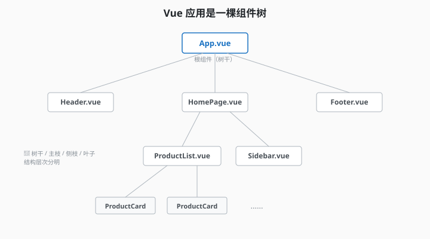
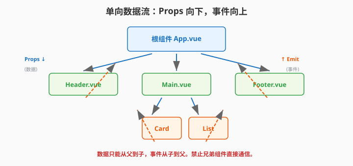
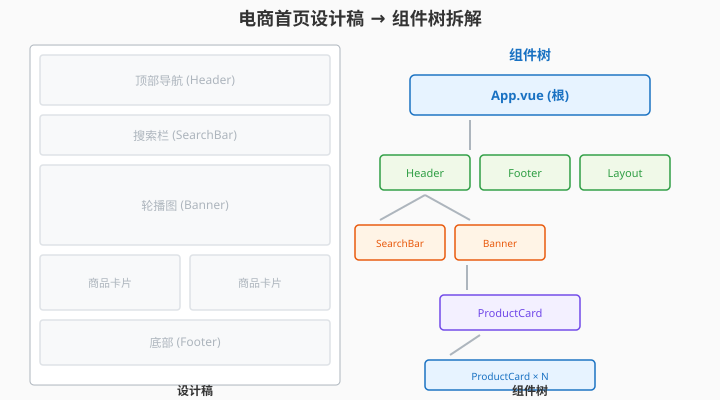

# 3.3 组件树：看清全局

> 章节：第 3 章 组件化思想
> 课时：1 课时

---

## 🎯 学习目标

学完这节，你将能够：

- ✅ **理解**：组件树是什么——Vue 应用的"骨架全景图"
- ✅ **掌握**：数据在组件树中的流向（Props 向下，事件向上）
- ✅ **应用**：用 Vue DevTools 查看组件树、调试数据流
- ✅ **培养**：拿到需求先画组件树的习惯

---

## 🧠 思维导图

```text
3.3 组件树：看清全局
├── 组件树是什么
│   ├── Vue 应用 = 一棵嵌套的组件树
│   ├── 根组件 App.vue 是树干
│   ├── 子组件是树枝
│   └── 数据在树中流动
├── 数据流向：黄金规则
│   ├── Props 向下（父→子）
│   ├── 事件向上（子→父）
│   ├── 兄弟组件不直接通信（通过父组件中转）
│   └── 这是 Vue 组件通信的核心约束
├── Vue DevTools：看穿组件树
│   ├── 安装浏览器扩展
│   ├── 查看组件层级
│   ├── 查看组件的 Props / data / computed
│   └── 时间旅行调试
├── 画组件树的步骤
│   ├── 步骤 1：找出页面上的"视觉模块"
│   ├── 步骤 2：标注每个模块的组件名
│   ├── 步骤 3：画出层级关系（谁是谁的子组件）
│   └── 步骤 4：标注数据流方向
└── 真实案例：电商首页的组件树
    ├── 识别 12 个视觉模块
    ├── 画出 4 层嵌套关系
    └── 标注核心数据流
```

写两三个组件时，你还记得谁是谁的爸爸；组件到十几个、嵌套两三层的阶段，报错一来你就得猜：是 `App.vue` 传下去的 props 不对，还是中间某层偷偷改了数据？前端团队最常问"这组件到底挂在谁下面"。本节把嵌套关系画成"组件树"——有了这张全局地图，找 Bug 和加需求都快得多。

---

## 🤔 一、组件树：Vue 应用的"骨架全景图"

前面 7 节我们一直在讲"怎么拆组件"、"怎么设计组件"、"怎么组合组件"。但你有没有想过——**这些组件拼在一起，到底是什么样子的？**

答案：**一棵树**。

每一个 Vue 应用，不管简单还是复杂，本质上都是一棵**组件树**（Component Tree）：

```text
                  App.vue（根组件 —— 树干）
                 /      |       \
                /       |        \
     Header.vue   HomePage.vue   Footer.vue（一级子组件 —— 主枝）
                    /      \
                   /        \
        ProductList.vue   Sidebar.vue（二级子组件 —— 侧枝）
           /      \
          /        \
  ProductCard  ProductCard  ...（三级子组件 —— 叶子）
```

> 💬 **老师备注**：**养成画组件树的习惯，比背 API 更重要**。你面试时如果被问到"这个页面怎么设计"，第一反应应该是**在白板上画组件树**，而不是直接写代码。



### 为什么组件树很重要？

| 好处 | 说明 |
|---|---|
| **一眼看清全局** | 不用翻代码就知道有哪些组件 |
| **发现设计问题** | 嵌套太深说明拆得过细；一个组件子节点太多说明职责不单一 |
| **理清数据流** | Props 向下、事件向上，在树上标注后清晰无比 |
| **团队沟通** | "这个数据从 A 传到 B 再到 C" → 在树上一目了然 |

---

## 💡 二、数据流向：黄金规则

组件树的灵魂不是"谁嵌套了谁"，而是**数据怎么在树中流动**。

### Vue 组件通信的黄金规则

```text
🎯 Props 向下，事件向上 —— 这是铁律！

父组件 ──Props (数据)──→ 子组件
父组件 ←──emit (事件)─── 子组件

兄弟组件？不直接通信，通过父组件中转。
```



### 规则的含义

- **Props 向下**：父组件通过 Props 把数据传给子组件。**永远只有父传子，不能反过来**。
- **事件向上**：子组件通过 `$emit` 把事件（和参数）传给父组件，告诉父组件"有事情发生了"。**永远只有子传父，不能反过来**。
- **兄弟隔离**：兄弟组件之间不能直接通信。如果 A 组件需要影响 B 组件，流程必须是 `A → emit → 父组件 → 修改数据 → Props → B`。

> 💬 **老师备注**：这个"单向数据流"不是 Vue 的 bug，是**刻意设计**。它让数据流可预测——你永远知道数据是从上往下流的，不会出现"改了一个地方，不知道哪里也跟着变了"的混乱局面。

### 在组件树上标注数据流

```text
App.vue
├── [Props: user, cartCount] → AppHeader
│     ← [emit: logout]
│
├── [Props: products] → ProductList
│     ← [emit: add-to-cart]
│   ├── [Props: product] → ProductCard
│   │     ← [emit: buy]
│   └── [Props: product] → ProductCard
│
└── [Props: cartCount] → CartIcon
      ← [emit: open-cart]
```

**标注规则**：
- `→` 方向 + `Props:` = 父传子的数据
- `←` 方向 + `emit:` = 子传父的事件

---

## 💡 三、Vue DevTools：看穿组件树

理论说再多，不如亲眼看一下。Vue DevTools 是一个浏览器扩展，能让你**实时查看**运行中的 Vue 应用的组件树。

### 安装

- **Chrome**：[Chrome Web Store](https://chrome.google.com/webstore) 搜索 "Vue.js devtools"
- **Edge**：同上，Edge 商店
- **Firefox**：Firefox Add-ons 搜索 "Vue.js devtools"

安装后在浏览器 DevTools（F12）中会多出一个 "Vue" 标签页。

### 核心功能

| 面板 | 能看到什么 |
|---|---|
| **Components** | 组件树（层级关系）、每个组件的 Props / data / computed |
| **Timeline** | 组件渲染性能、事件触发时间线 |
| **Pinia** | Pinia Store 的状态（第 11 章） |
| **Router** | 当前路由信息（第 10 章） |

### 调试实战

1. 打开你的 `my-vue-app` 项目
2. F12 打开 DevTools → 切换到 **Vue** 标签
3. 点击 **Components** 面板
4. 你会看到一棵真实的组件树：
   - 点击 `<App>` → 看到它的 Props（如果有的话）
   - 点击 `<HelloWorld>` → 看到 `msg` 属性
   - **直接修改** Props 的值 → 页面实时更新！

> 💬 **老师备注**：DevTools 的 Components 面板支持**直接编辑数据**——点一下 `msg` 的值，改成别的，页面上文字马上变。这是调试 Vue 最快的途径之一，一定要学会。

---

## 🛠 四、完整案例：画出电商首页的组件树

假设你要做一个电商首页，产品给的设计稿长这样：



### 步骤 1：找出页面上的"视觉模块"

对照设计稿，标注每一个**独立的 UI 区块**：

```text
┌──────────────────────────────────────┐
│  1. 顶部导航栏（Logo + 菜单 + 购物车图标） │
├──────────────────────────────────────┤
│  2. 搜索栏（输入框 + 搜索按钮）           │
├──────────────────────────────────────┤
│  3. 轮播 Banner（3 张图自动滚动）        │
├──────────────────────────────────────┤
│  4. 分类导航（图标 + 文字，横行排列）     │
├──────────────────────────────────────┤
│  5. 限时抢购区块（标题 + 倒计时 + 商品卡）  │
├──────────────────────────────────────┤
│  6. 推荐商品网格（标题 + 4×N 商品卡片）   │
├──────────────────────────────────────┤
│  7. 底部信息（版权 + 链接）              │
└──────────────────────────────────────┘
```

### 步骤 2：给每个模块起组件名

| 编号 | 视觉模块 | 组件名 | 层级 |
|---|---|---|---|
| 1 | 顶部导航栏 | `<AppHeader />` | 一级 |
| 2 | 搜索栏 | `<SearchBar />` | 一级 |
| 3 | 轮播 Banner | `<HomeBanner />` | 一级 |
| 4 | 分类导航 | `<CategoryNav />` | 一级 |
| 5 | 限时抢购 | `<FlashSale />` | 一级 |
| 6 | 推荐商品 | `<ProductGrid />` | 一级 |
| 7 | 底部信息 | `<AppFooter />` | 一级 |

### 步骤 3：画出层级关系

```text
App.vue
├── AppHeader.vue
│   └── CartBadge.vue              ← 购物车角标（Header 的子组件）
├── main (页面主体区域)
│   ├── SearchBar.vue
│   ├── HomeBanner.vue
│   ├── CategoryNav.vue
│   │   └── CategoryItem.vue       ← 单个分类图标 + 文字（v-for 循环）
│   ├── FlashSale.vue
│   │   ├── Countdown.vue          ← 倒计时组件
│   │   └── ProductCard.vue        ← 秒杀商品卡片（v-for 循环）
│   └── ProductGrid.vue
│       └── ProductCard.vue        ← 商品卡片（复用！跟秒杀用同一个）
└── AppFooter.vue
```

**关键发现**：
- `ProductCard` 在 `FlashSale` 和 `ProductGrid` 里**复用了**——这说明设计合理
- `Countdown` 只在 `FlashSale` 里用——遵循就近原则
- 最多嵌套 3 层——深度合理

### 步骤 4：标注数据流

```text
App.vue (数据：cartCount, userInfo, products, flashProducts)
│
├── → Props: { cartCount }          → AppHeader
│   └── → Props: { count: cartCount } → CartBadge
│
├── → Props: { products }           → FlashSale
│   │   ← emit: add-to-cart(product)
│   ├── → Props: { endTime }         → Countdown
│   └── → Props: { product }         → ProductCard
│       ← emit: buy(product)
│
├── → Props: { products }           → ProductGrid
│   └── → Props: { product }         → ProductCard
│       ← emit: buy(product)
│
└── AppFooter (无 Props，静态组件)
```

**数据来源分析**：
- `products`、`flashProducts` 在 App.vue 中管理（或从 API 获取）
- `cartCount` 在 App.vue 中管理（每次 `add-to-cart` 事件触发时 +1）
- 所有购买操作最终 emit 到 App.vue 统一处理

> 💬 **老师备注**：画组件树的时候，**数据流标注不是可选的，是必须的**。因为这直接决定了 Props 怎么设计、事件怎么定义。很多人写代码写到一半才发现"哎呀这个数据传不过去"，就是因为没画数据流。

---

## 💡 五、组件树的"健康检查"清单

画完组件树后，用这个清单检查设计是否合理：

| 检查项 | 健康标准 | 警示信号 |
|---|---|---|
| **深度** | 不超过 4 层 | 超过 4 层 → 考虑扁平化 |
| **广度** | 单个组件 ≤ 7 个直接子节点 | > 10 个 → 考虑中间容器组件 |
| **复用** | 至少 3 个组件出现 ≥ 2 次 | 没有复用 → 检查是否拆得过细 |
| **数据流** | 每个 Props/emit 都有明确来源/去向 | 出现"不知道为什么传这个"的 Props |
| **单一职责** | 每个组件能一句话说清 | 出现"它负责 A 和 B 和 C"的组件 |

---

## ⚠️ 六、常见陷阱

### 陷阱 1：在脑子里"假装"有组件树

很多新手不画图，觉得"我自己想清楚了"。结果是写代码时频繁重构——"哦原来这个组件应该放这层"。

**解决办法**：哪怕只花 3 分钟在纸上画一下，也比全靠脑子强。

### 陷阱 2：组件树 ≠ 文件目录

组件树是**运行时结构**（谁嵌套在谁里面），文件目录是**磁盘结构**（文件物理位置）。两者**不一定一一对应**。一个组件可以 import 另一个组件不管它们在哪个文件夹。

### 陷阱 3：忽视 DevTools

很多人不知道 Vue DevTools 的存在，调试全靠 `console.log`。DevTools 能让你**实时看到整个组件树和每个组件的状态**，效率高出 10 倍。

---

## 🧠 本节小结

- **组件树 = 骨架全景图**：每个组件是节点，`App.vue` 是根，嵌套关系一目了然
- **黄金规则——单向数据流**：数据从父组件流向子组件（Props 向下、事件向上），禁止子组件偷偷改父数据
- **DevTools 是透视镜**：Components 面板能实时查看组件树与每层数据，调试必备
- **画树四步**：找视觉模块 → 起组件名 → 画层级 → 标数据流
- **健康检查**：树太深要警惕、Props 传递层数过多要重构、孤立组件要想清楚归属

---

## 📝 即时练习

**练习 1（画组件树）**：
打开一个你熟悉的网站（比如 B 站首页），在纸上画出它的组件树。标注每个组件的名称和层级（3-4 层即可）。

**练习 2（动手）**：
在你的 `my-vue-app` 项目中，用 Vue DevTools 查看组件树。至少做到：
- 找到 `<App>` 的 Props
- 展开 `<HelloWorld>` 查看 `msg` 的值
- 直接在 DevTools 里修改 `msg` 的值，观察页面变化

**练习 3（设计）**：
为"学生管理系统"画出组件树，至少包含：登录页、仪表盘页（导航+侧边栏+主内容区）、学生列表页（搜索+表格+分页+弹窗）。标注数据流。

---

## 📚 拓展阅读

- [Vue DevTools 官方文档](https://devtools.vuejs.org/)
- [Vue 3 官方文档 - 组件深入](https://cn.vuejs.org/guide/components/attrs.html)
- [React 组件树 vs Vue 组件树](https://cn.vuejs.org/guide/extras/composition-api-faq.html)（概念相通）

---

**（3.3 节结束，下一节 3.4 讲选项式 vs 组合式 API →）**
