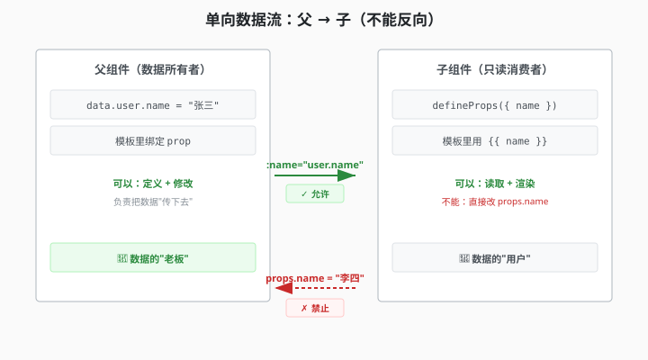

# 4.3 Props 的规矩：只读

> 章节：第 4 章 Props 和事件
> 课时：0.5 课时

---

## 🎯 学习目标

学完这节，你将能够：

- ✅ **理解**：为什么 Props 是"只读"的——单向数据流的铁律
- ✅ **掌握**：子组件需要"改数据"时的正确做法
- ✅ **区分**：什么时候数据该留在父组件、什么时候可以本地化
- ✅ **避免**：直接修改 props 导致的 bug 和警告

---

## 🧠 思维导图

```text
4.3 Props 的规矩：只读
├── 为什么 Props 是只读的
│   ├── 单向数据流：数据从父流向子，不反向
│   ├── 防止"谁也说不清数据是谁改的"
│   └── 保证数据流可追踪、可调试
├── 违反规矩会怎样
│   ├── 直接改 prop：Vue 会报警告
│   ├── 对象/数组的 prop：改了不报错但极不推荐
│   └── 长期后果：数据来源混乱、bug 难排查
├── 正确的"修改"姿势
│   ├── 方案 1：子组件 emit 事件，让父组件改
│   ├── 方案 2：子组件用 computed 派生新值
│   ├── 方案 3：子组件本地化 prop 副本
│   └── 方案 4：用 v-model（后面 4.7 节讲）
└── 选择原则
    ├── 数据归属 = 父组件 → 走 emit
    ├── 纯展示变形 → 走 computed
    └── 初始化后独立管理 → 走本地副本
```

Props 用顺手后，很多人顺手在子组件里改数据：`props.count++`、`props.user.name='新名字'`。诡异的是，改基础类型 Vue 会警告，改对象属性却不报错——于是你以为没事了，等父组件数据一变，两边对不上，查半天都不知道谁改的。这正是本节要讲的铁律：Props 只读，以及想改数据时的三种正确姿势。

---

## 🤔 一、为什么 Props 是只读的？

先记住一个铁律：

> **Props 的数据所有权属于父组件，子组件只有"使用权"，没有"修改权"。**

用现实生活类比——你爸给你一张银行卡，你可以拿这张卡**消费**（读取数据），但你不能**改密码**（修改余额）。密码是银行（父组件）管的。

如果你允许子组件随便改 props，会出什么问题？



假如 `UserCard` 里改了 `name`：

1. 父组件里的 `user.name` 没变 → 数据和 UI 不一致
2. 另一个子组件 `<UserAvatar :name="user.name" />` 也没变 → 组件之间的数据不同步
3. 你查 bug 时完全不知道 `name` 是"谁在什么时候改的"

这就是 Vue 强制 **"单向数据流"** 的原因——**数据总是从父组件流向子组件，绝不能反向写回**。

---

## 💡 二、违反规矩会怎样？

### 场景 1：直接修改基础类型 prop

```vue
<!-- 子组件 -->
<script setup>
const props = defineProps(['name'])

function changeName() {
  // ❌ 控制台会打印警告：
  // [Vue warn] Set operation on key "name" failed: target is readonly.
  props.name = '李四'
}
</script>
```

基础类型（字符串、数字、布尔）的 prop 是**直接冻结**的，改了会报 `readonly` 警告。

### 场景 2：修改对象/数组 prop 的属性

```
<script setup>
const props = defineProps({
  user: Object
})

function changeName() {
  // ⚠️ Vue 不会报错，但极不推荐！
  props.user.name = '李四'
}
</script>
```

对象和数组是引用类型，Vue 的只读保护只冻结了**引用本身**，属性可以改。**虽然不报错，但这比直接改还危险**——因为你悄无声息地污染了父组件的数据，别人根本查不到谁干的。

---

## 💡 三、正确的"修改"姿势

### 方案 1：emit 事件，让父组件改（推荐）

子组件不碰数据，只发信号："我要改这个值，你来改"。

```vue
<!-- 子组件 TodoItem.vue -->
<script setup>
const props = defineProps(['text'])
const emit = defineEmits(['update-text'])

function handleEdit() {
  // 发信号给父组件：请把 text 改成 '新内容'
  emit('update-text', '新内容')
}
</script>
```

（emit 的详细用法在 4.5、4.6 节讲）

### 方案 2：computed 派生新值（展示型）

只做格式化/转换，不影响原始数据。

```
<script setup>
import { computed } from 'vue'

const props = defineProps(['price'])

// ✅ 派生一个新值：价格加货币符号，不修改 price 本身
const displayPrice = computed(() => `¥${props.price.toFixed(2)}`)
</script>

<template>
  <span>{{ displayPrice }}</span>
</template>
```

### 方案 3：本地化副本（初始化后独立管理）

用 prop 的初始值，之后自己管。

```vue
<script setup>
import { ref } from 'vue'

const props = defineProps(['initialCount'])

// ✅ 用 prop 的初始值创建本地副本
// 之后 count 的变化跟 props.initialCount 无关
const count = ref(props.initialCount)

function increment() {
  count.value++
}
</script>

<template>
  <button @click="increment">{{ count }}</button>
</template>
```

> 💬 **老师备注**：注意命名——最好给 prop 加个 `initial` 前缀（`initialCount`），提醒自己和同事：这只是一个初始值，之后内部会自己管。

---

## 🛠 四、完整可运行示例：计数器组件

```
<!-- Counter.vue —— 子组件 -->
<script setup>
import { ref, computed } from 'vue'

const props = defineProps({
  initialCount: {
    type: Number,
    default: 0
  },
  step: {
    type: Number,
    default: 1
  },
  label: String
})

// 方案 3：本地化副本
const count = ref(props.initialCount)

// 方案 2：派生值
const displayLabel = computed(() => {
  return props.label ? `${props.label}：${count.value}` : count.value
})

const emit = defineEmits(['max-reached'])

function increment() {
  count.value += props.step
  if (count.value >= 100) {
    // 方案 1：通知父组件
    emit('max-reached', count.value)
  }
}
</script>

<template>
  <div class="counter">
    <span class="label">{{ displayLabel }}</span>
    <button @click="increment" class="btn">+{{ step }}</button>
  </div>
</template>

<style scoped>
.counter {
  display: flex;
  align-items: center;
  gap: 12px;
  padding: 12px 16px;
  border: 1px solid #e2e8f0;
  border-radius: 8px;
  width: fit-content;
}
.label {
  font-size: 18px;
  font-weight: 600;
  color: #1a202c;
  min-width: 80px;
}
.btn {
  padding: 6px 16px;
  border: none;
  border-radius: 6px;
  background: #42b883;
  color: #fff;
  font-size: 16px;
  cursor: pointer;
}
.btn:hover {
  background: #38a06c;
}
</style>
```

```vue
<!-- App.vue —— 父组件 -->
<script setup>
import Counter from './components/Counter.vue'

function handleMaxReached(val) {
  alert(`计数器已达 ${val}，超过上限！`)
}
</script>

<template>
  <Counter
    :initial-count="0"
    :step="5"
    label="积分"
    @max-reached="handleMaxReached"
  />
</template>
```

运行效果：子组件拿到 `initialCount` 后创建本地副本 `count`，点击按钮只改 `count`，不动 prop。当 `count` 超过 100 时 emit 事件通知父组件。三种正确姿势全用上了。

---

## ⚠️ 五、常见陷阱

### 陷阱 1：忘了加 `initial` 前缀

```
<!-- ❌ 容易误导：让人觉得 count 跟 prop 是同一个东西 -->
const props = defineProps(['count'])
const count = ref(props.count)

<!-- ✅ 清晰：一眼看出 prop 只是初始值 -->
const props = defineProps(['initialCount'])
const count = ref(props.initialCount)
```

### 陷阱 2：修改引用类型 prop 的深层属性

```vue
const props = defineProps({ config: Object })

// ❌ 静默污染父组件数据，最难排查的 bug
props.config.theme = 'dark'

// ✅ 深拷贝后修改自己的副本
import { ref } from 'vue'
const localConfig = ref(JSON.parse(JSON.stringify(props.config)))
localConfig.value.theme = 'dark'
```

### 陷阱 3：本地副本不会跟着 prop 更新

```
const props = defineProps(['initialName'])
const name = ref(props.initialName)
// 之后父组件改了 initialName → name 不会跟着变！
```

如果你希望父组件更新 prop 时本地副本也同步，用 `watch`（第 6 章讲）。

---

## 🧠 本节小结

- **铁律：Props 只读**——数据所有权在父组件，子组件只有使用权，这是"单向数据流"的核心
- **为什么只读**：谁都能改会造成数据来源混乱，Bug 难追踪；框架约束后数据流一目了然
- **违反的后果**：改基础类型 prop 会告警；改对象/数组的深层属性不报错但极不推荐，父组件更新时会互相打架
- **正确的"修改"姿势**：需要父组件改 → emit 事件；纯展示变形 → computed 派生；初始化后独立管理 → 本地副本
- **选型口诀**：数据归属父组件就向上喊话，别在子组件里偷偷改

> 下一步：4.4 讲解构 Props——怎么既写得简洁又不丢响应式。

---

## 📝 即时练习

**练习 1**：写一个 `Timer` 组件，接收 `initialSeconds` prop（初始秒数），内部用 `ref` 创建本地计数器，每秒 -1。当倒计时归零时 emit 事件通知父组件。

**练习 2**：以下场景分别该用哪种方案？（方案 1 emit / 方案 2 computed / 方案 3 本地副本）
- 商品价格 prop，需要显示 `¥299.00`
- 购物车数量 prop，用户在子组件里点击按钮增减
- 用户昵称 prop，子组件里要显示"你好，XXX"

**练习 3**：修改练习 1 的 `Timer`，添加一个 `label` prop，用 `computed` 显示"距离结束还有 X 秒"。

---

## 📚 拓展阅读

- [Vue 3 官方文档 - 单向数据流](https://cn.vuejs.org/guide/components/props.html#one-way-data-flow)
- [Vue 3 官方文档 - 组合式 API 响应式](https://cn.vuejs.org/guide/essentials/reactivity-fundamentals.html)

---

**（4.3 节结束，下一节 4.4 讲解构 Props →）**
